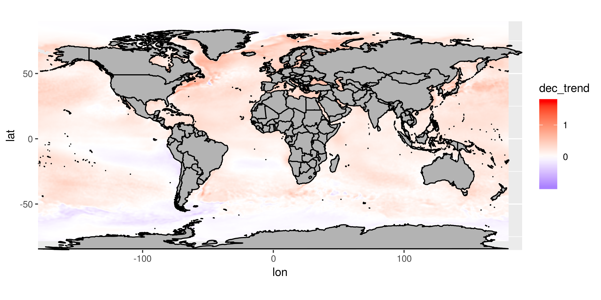
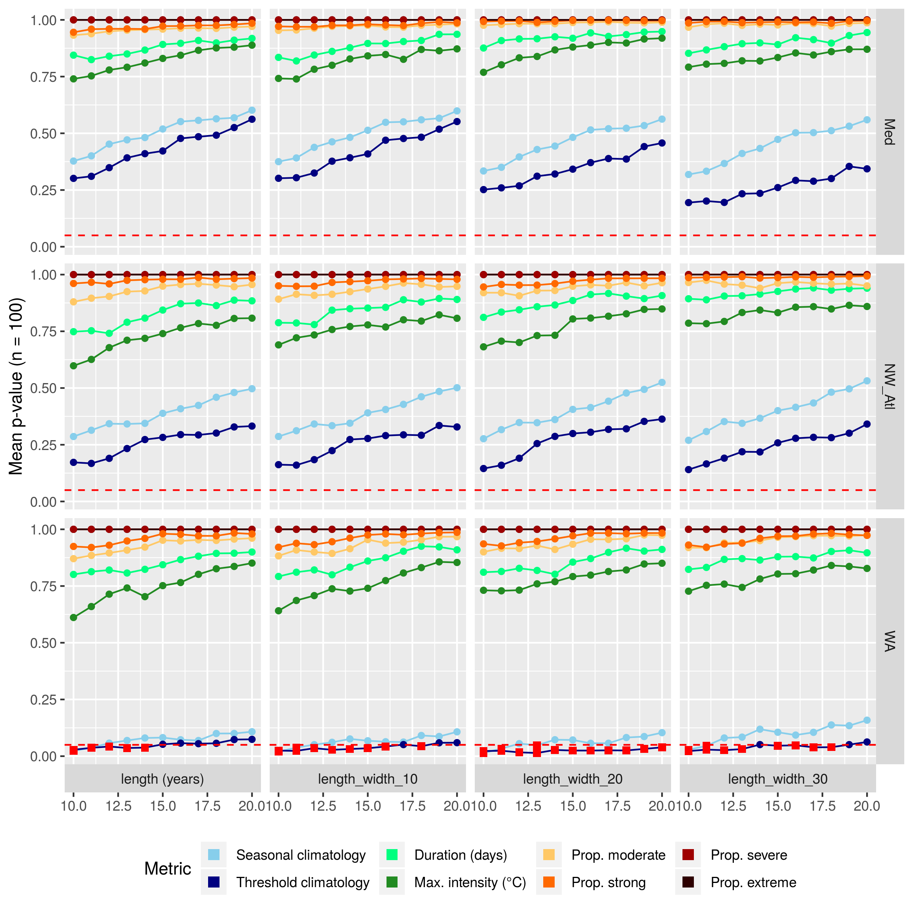
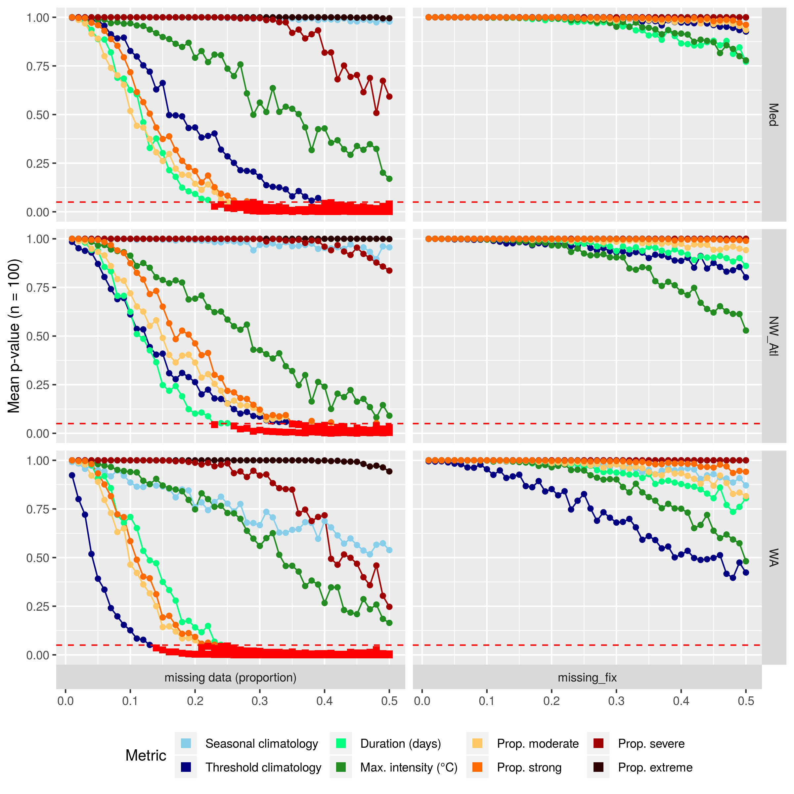

```{r global_options, include = FALSE}
knitr::opts_chunk$set(fig.width = 8, fig.align = 'center',
                      echo = TRUE, warning = FALSE, message = FALSE, 
                      eval = TRUE, tidy = FALSE)
```

1: Department of Oceanography, Dalhousie University, Halifax, Nova Scotia, Canada
2: Department of Biodiversity and Conservation Biology, University of the Western Cape, Bellville, South Africa
3: CSIRO Marine and Atmosphere, Hobart, Tasmania, 7000, Australia


# Abstract

Marine heatwaves (MHWs), or prolonged periods of anomalously warm sea water temperatures, have been increasing in duration and intensity globally for decades. However, there are many coastal, sea, and ocean regions where our ability to accurately detect MHWs is uncertain, due to the unavailability of high-quality data. Here we investigate the effect that short time series length, missing data, or linear decadal temperature trends may have on the accurate detection of MHWs. We show that time series as short as 10 years could still be used to accurately estimate the duration and intensities of MHWs, as compared with results from a full 30 year time series, but the accurate identification of temperature thresholds could be impaired when fewer than 15 years of data were used. We also show that for time series missing less than 20% of their data, the intensity-based MHW categories did not differ significantly from those detected in complete time series. Linear decadal trends as low as 0.05 -- 0.15°C/dec could lead to inaccurate creation of seasonal climatologies, but this did not impact accurate MHW detection. The percentage of missing data in a time series was determined to have the most dramatic effect on the accurate detection of MHWs, while time series length had a less important but more chaotic effect on MHWs. We provide suggestions for best practices to improve the accuracy of MHW detection with sub-optimal time series using specific case studies of three notable MHWs from the literature.  
(244 words)


# Introduction
  
The idea of hot seawater being problematic is not a novel concept. We have known for decades, perhaps millennia, that seemingly transient hot water occurrences in the ocean could result in major impacts [e.g. @Salinger2016]. It was perhaps due to our lack of ability to track and record ocean temperatures globally that researchers did not begin to quantify the effects of anomalously warm seawater temperatures until the early 1980s when research into the ENSO phenomenon began [e.g. @Philander1983]. Moving forward from the 80's, researchers began noticing that warm water events were becoming more frequent and problematic, but wasn't until 2018 that this was proven [@Oliver2018]. In order to quantify the increased occurrence and severity of these events it was necessary to develop a methodology that would be inter-comparable for the entire planet. This was accomplished in 2016 when a group of marine scientists convened a series of workshops to address this issue [@Hobday2016]. This definition for anomalously warm seawater events, known as marine heatwaves (MHWs), has seen wide-spread and rapid adoption due to it's ease of use and applicability to any part of the planet. One problem with this definition/algorithm that has not yet been addressed is that the accurate detection of MHW currently assumes that the researcher has access to the highest quality data available.

<!-- A recent paper has looked back at these ENSO fueled hot water events in the 80's did have negative impacts on multiple ecosystems [@Smale2019].  -->

With the advent of remotely-sensed sea surface temperature (SST) products in the late 70's oceanographers and other marine stake holders were given a birds eye view of the worlds oceans, no longer relying on along-ship records and stationary moorings to infer temperature for meso-scale features and larger. These remotely-sensed data, and more recently modelled data, are considered to be very high quality because many of these data products no consist of over 30 years of data and utilise clever techniques to fill gaps introduced into the time series from a number of environmental and technical sources. Whereas these data are generally lauded as being high quality, they too face many challenges (e.g. land bleed and incorrect data flagging) and so it is often recommended that researchers utilise lower quality data, such as sporadically collected _in situ_ time series. It is also often the coastal areas that are poorly sampled that are the most susceptible to the impacts of MHWs (cite) and so it is necessary to address the issues that using sub-optimal data may have on the accurate detection of MHWs.

This paper seeks to address the challenges that sub-optimal data introduce into the accurate detection of MHWs. Of primary interest are three key challenges: 1) The use of short time series, 2) the use of time series with missing data, 3) the use of time series in areas with large decadal trends in the increase of temperatures. We will use a combination of eularian reference time series and global data to address these issues. The effects of the three sub-optimal data challenges on MHW results are quantified in order to provide researchers with the level of confidence they may express in their results. Where possible, best practices for the correction of these issues are detailed.


# Defining marine heatwaves

A widely used definition for MHWs is "a prolonged discrete anomalously warm water event that can be described by its duration, intensity, rate of evolution, and spatial extent." [@Hobday2016]. Accompanying this qualitative definition is a quantified form (an algorithm) that enables the calculation of a suite of metrics. Researchers may then use these metrics to characterise the events and to effectively compare them against known ecological/financial impacts. A full explanation for these metrics may be found in Table 2 of @Hobday2016.

It is perhaps due to the ease and interoperability of this methodology that it has seen rapidly increasing use across marine sciences (cite?). This has introduced a new series of meta-issues in that different groups often depart from the default use of the algorithm for MHW detection in varying degrees (e.g. cite Spanish paper), or simply use entirely different methodologies [e.g. @Frolicher2018] while referring to the @Hobday2016 definition. This has given rise to concerns over best practices. What should a group do if faced with a particular challenge, such as wanting to use an _in situ_ collected time series of bottom temperatures that is only 15 years old? Or perhaps using a time series that is collected by hand during only weekdays, and not weekends? 

Here we explore additional issues that can improve the use of use of the @Hobday2016 and @Hobday2018 methodology, and ensure that results remain comparable if performed with data that do not meet the minimum requirements of length that were first suggested, and data with large proportions of missing values. An advantage of the @Hobday2016 and @Hobday2018 approach is that it has been developed for python (<https://github.com/ecjoliver/marineHeatWaves>), R [@Schlegel2018], and MATLAB [@Zhao2019]. For this analysis we compared the R and python default outputs, how changing the arguments affected the results, as well as a comparison of the other functionality provided between the two languages. While some style differences exist between the added functionality of the languages, the core climatology outputs are identical to within < 0.001 °C per day-of-year (doy). An independent analysis of the Python and MATLAB results also confirmed that they were functionally identical (pers. com. Zijie Zhao; MATLAB distribution author).


# What are robust data for detecting marine heatwaves?

@Hobday2016 stated that the data used for the detection of MHWs should be of the highest quality possible to ensure inter-comparability of results. Specific examples given were that the data should 1) be of at least 30 years in length, 2) be quality controlled, 3) be of the highest resolution possible, and 4) high quality _in situ_ data should be used to compliment remotely sensed data where possible. Whereas the authors did not specifically state that time series must not contain large proportions of missing data, it can be inferred from the aforementioned requirements. There are a number of methods within the already existing tools for detecting MHWs that can address these concerns and we will lay them out here. An issue not introduced in @Hobday2016 is the effect of long-term trends on the accurate detection of events. @Oliver2018 have shown how dominant the climate change signal can be in the detection of events and we seek to quantify this effect here.

The length of a time series may affect the detection of a MHW by negatively affecting the creation of an accurate daily climatology relative to which the events can be detected in two primary ways. The first is that with fewer years of data to draw from, the presence of an anomalously warm or cold year will have a larger effect on the climatology than with a sample size of 30 years. The second cause is that because the world is generally warming [@IPCC2014], the use of a shorter time series will almost certainly warm bias the results. For this reason we have removed the secular trend from all of the tests performed to answer the first two questions proposed in this research (see below).

Assuming that one does have enough data to accurately create a climatology, it then serves two main roles (WMO, 2017); 1) it serves as a ‘benchmark’ relative to which past and future measurements can be compared, and against which anomalies can be calculated, 2) it reflects the typical conditions likely to be experienced at a particular place at a particular time. The WMO technical guidelines (WMO, 2016) stipulate that daily climatologies (which they call ‘climate normal’) must be based on the most recent 30-year period that ends on a complete decade (currently 1981-2010). 

Some remotely sensed products suffer from ‘gappiness’ that result in missing data (NAs) being introduced. This may be due to cloud cover, the presence of sea ice, unsuitable sea states, etc., which become more prevalent at smaller scales, particularly nearer the coast. Some products smooth out these influences, but this results in smoothed SST fields that mask some of the small-scale spatial variation in surface temperatures. Other times they rely on blending with data from other products, which may have its own suite of consequences. This is why the use of imperfect _in situ_ collected time series may still be encouraged in certain situations. These data are however also prone to large gaps and so the problems these data face with regards to accurate event detection are generally uncertain. 

We have summarised the commonly used types of data products for the detection of MHWs and potential issues they may have. This information will allow the reader to more readily determine which fixes may be most useful for them.

* Insert Table 1 here, which summarise the data product types, their pros and cons

<!-- - _I'm thinking that the data summary section should be removed or severely shortened_   -->
    <!-- - _Perhaps just talk about the three broad categories and what their advantages and disadvantages are_ -->

<!-- Outlined here in a series of three tables are a non-exhaustive list of the products currently available for work with MHW detection. The advantages, disadvantages, and any known issues are listed with the products in addition to a brief summary of their meta-data and where they may be downloaded. The products are broken up into three broad categories: remotely sensed data, reanalysis data, and _in situ_ data. -->


<!-- ## Reference time series  -->

<!-- - _Show the time series from NOAA OISST; Western Australian (WA), NW Atlantic (NW Atl), and Mediterranean (Med) (henceforth reference time series)_  -->
<!-- - _Maybe include a description of the MHWs as detected from the “default algorithm parameters”, which we can then use as a reference for the rest of the work (i.e. sensitivity to time series length, missing values, etc…)_ -->
<!-- - _ A table shown below should include all aspects/statistics of the time series (e.g. range of seasonal signal) that will come out as important in the results section._ -->

```{r}

```

<!-- We see in the table above that the three default time series currently being used all have decadal trends much higher than the global average of ~0.1°C. -->


# Do I have enough data?

In order to quantify the effects that the three sub-optimal data challenges have on MHWs we have broken up the concept of a MHW into three parts:
  
1) The climatologies of the MHW, which are the seasonal signal and the 90th percentile threshold. 
2) The event itself, which is defined by the metrics given in Table 2 of @Hobday2016.  
    - We chose here to focus on only the duration (days) and maximum intensity (°C) metrics as these two values are most representative of an event.
    - Most other metrics may be inferred from these two metrics. 
3) The proportion of days of the event that are within the different categories.

With these three parts of a MHW defined, we then used the following three questions to frame the results:
  
1) How sub-optimal can data become before the results are significantly different from an optimal time series? 
2) What amounts of uncertainty are introduced into the results from the increasingly sub-optimal data?
    - For example, when 20% of data are missing, what should a user expect the standard error around the maximum intensity of a MHW to be?
3) Are the error rates vs. sub-optimal data the same/similar everywhere in the world, or do they differ based on some observable pattern/known oceanographic feature(s)?

In the following sub-sections we will describe how we controlled for the three sub-optimal time series challenges and outline how we ensured that one could still use these data in the face of these challenges. We will answer the first two questions with the reference time series described above. The third question will be answered with the use of the remotely sensed NOAA OISST dataset [@Reynolds2007].

<!-- We have used the category classification system from @Hobday2018 to benchmark our tests of data utility for MHW detection. Specifically we wanted to know how the different time series challenges affected our ability to detect different categories of MHWs. This is because category I MHWs are very common, and it seems from the literature that neither category I or II events are very important ecologically/financially. This means it is not of overwhelming concern if some time series deficiencies prevent the accurate detection of these smaller events. It is therefore the accurate detection of the category III and IV events that we use as a guiding principle for evaluating the severity of the time series deficiencies, and the usefulness of the methods proposed to counteract them. -->


## Assessing the effect of time series length

In order to determine at what number of years detected MHWs in shortened time series become significantly different from an assumed truth, based on a standard 30-year record, we first remove the long-term linear trends in the data before systematically shortening the reference time series one year at a time, from the maximum length currently available length of 37 years (start date of 1982), down to a minimum length of ten years (start date of 2009), before comparing the results with a Kolmogorov-Smirnov test. This test is designed specifically to look for differences in the distribution of values between two sets of data, rather than testing for differences of central tendency (e.g. t-test or ANOVA). It was decided to not test for central tendency as the assumption that the results were normally distributed was usually violated.

In order to make this analysis more robust, the above methodology was also performed on each reference time series with the order of the years randomly re-sampled and recombined 100 times. We chose this method instead of creating artificial time series with comparable auto-correlation structures as it ensured that the large historical MHWs present in the reference time series could still be accounted for as these are an important reason why these time series were chosen. Because it would violate the assumption of equitable sample sizes were we to compare events from a 30 year time series against a much shorter time series, we have limited the length of the shortest time series being compared to 10 years and compare only events from the different lengths of time series that only occurred in the most recent 10 years. This was so that we could still have a reasonable sample size to draw from as we could only compare the results from time series of varying lengths for years in which they overlapped. Because the lengths of the time series were being varied, it was also necessary that the climatology period vary likewise. To maintain as much consistency as possible across the results we used the full range of years within each shortened time series to determine the climatology. For example, if the time series had been shortened from 37 to 32 years (1987 -- 2018), the 32 year period was used to create the climatology. If the shortened time series was 15 years long (2004 -- 2018), then this base period was used. The control time series were those with a 30 year length (1989 -- 2018).

The proposed fix to address the issue of short time series is to use a different climatology estimation technique. The option currently available within the MHW detection algorithm is to expand the window half width used when smoothing the climatology. Other techniques, such as harmonic regression/Fourier analysis, would have a similar effect and so are not used explicitly here in favour of a methodology already available within the MHW algorithm.


## Assessing the effect of missing data

In order to determine how much random missing data could be accommodated before the MHW results began to differ significantly, we randomly removed 0 -- 99% of the data in 1% steps from the 100 re-sampled de-trended reference time series before performing the standard MHW analysis.

The quantification of the effect of missing data on the results was performed with the same statistical tests as for time series length. The difference being that the full 37 years of data were used for each test, and the climatology period used was the recommended standard of 1982 -- 2011. The control time series were those with 0% missing data.

The proposed fix for the issue of missing data in the time series is to linearly interpolate over any gaps. There are many methods of interpolation/forecasting available to fill gaps time series, but we choose to go with linear interpolation here because of its simplicity and because it is already available in the MHW algorithm.


## The role of long-term trends

It is known that the long-term secular trend in a time series may have an effect on the accurate detection of MHWs. To quantify what this effect may be we started with the 100 de-trended re-sampled reference time series and added decadal trends of 0.00 -- 0.30°C/dec in 0.01°C steps to each. The difference this caused in the results was quantified with the same tests as for length and missing data. The control time series were those with no added trend.

There is no proposed method to correct for the added decadal trend as this would be to simply not add it. Defeating the purpose of the whole endeavour. Rather it is proposed that the relationship between the slope of the added trend and the results it has on the MHWs be documented to determine if a predictable relationship may be used to correct the results _post-hoc_.

# Results

## Time series length

The left hand column of Figure 1 shows the effect that shortening the lengths of the 100 re-sampled reference time series had on the comparability of the MHW results. With the exception of the Western Australia (WA) time series we see that there is no point at which any of the MHW results become significantly different from the 30 year control time series. The WA time series, which is characterised by its very large inter-annual variability, only shows significantly different threshold climatologies when 14 years of data or fewer are used. The seasonal climatology does not differ significantly until 11 years of data or fewer are being used. It is important to note that increasing the climatology period larger than 30 years has almost as rapid an effect on creating dissimilar MHW results as using fewer years of data does. This was an unexpected result that stresses the importance of adhering to the WMO standard as closely as possible to ensure the comparability of results. 

![Figure 1: The results from Kolmogorov-Smirnov (KS) tests on the similarity of distributions of MHW results given different sub-optimal data conditions. The MHW properties are shown in different colours as shown in the legend at the bottom of the figure. Each data point shows the mean _p_-value for each test at each step from the 100 re-sampled repetitions. The three columns show the different tests: length (years),  missing data (proportion), and added trend (°C/dec). The three rows show the three reference time series: Med = Mediterranean, NW_Atl = North West Atlantic, WA = Western Australia. The x-axis shows the value of the sub-optimal test and is different for each column. The y-axis shows the range of mean _p_-values from 1.0 (exact same) to 0.0 (completely different), with a horizontal dashed red line at 0.05 (statistically significantly different). Any points at or below the the 0.05 line are highlighted with red squares](../LaTeX/fig_2.png)

The left hand column in Figure 2 shows the effect that shortening a time series length has on the duration and max. intensity of the focus MHW for the real data (not re-sampled) from each reference time series. Because the shortening of a time series tends to increase the 90th percentile threshold by making it more vulnerable to outliers, we see that the shorter a time series becomes, the less the max. intensity and duration of the MHWs become (Figure 2; bottom and middle panels). We also see that the Western Australia (WA) and North West Atlantic (NW_Atl) MHWs are very quickly cut up into 2 or more MHWs due to the rising 90th perc. threshold (Figure 2; top panel). The Mediterranean (Med) MHW isn't affected much by time series length as it has little fluctuation. Meaning it goes up and comes down, with no dips in the middle like the other two reference MHWs.

![Figure 2: the effect of the three tests (columns) on the three most relevant metrics (rows). Each panel has three lines, one for each of the reference time series, shown in the legend at the bottom of the figure. These are the real data, not any of the random re-samples from Question1 . The lines track the change of just one metric for just one MHW as the data are made increasingly sub-optimal, as shown along the x-axes. The y-axes show the unit of measurement for each metric. The top row, "count (event)" shows if the MHW is being chopped up into multiple smaller MHWs due to changes in the values along the x-axes.](../output/effect_event.png)

When looking globally in Figure 3 we see that...




## Missing data

(RWS: Please note that the write up in this section reflects the results for missing data only from 0 -- 50%. I've not had time since flying to Texas to interpret the output of the effect of missing data up to 99%)

The effects of missing data on MHW results is very pronounced. The middle column of Figure 1 shows how quickly the results approach a level of significant difference. The values most affected are the threshold climatology, the duration of the MHWs, and the proportions of MHW days in the moderate & strong categories. The maximum intensities of the MHWs are also affected, but at 50% missing data these did not become significantly different from the control time series. The proportion of severe or extreme days were not affected by missing data as they were already so rare or non-existent outside of the WA time series. The seasonal signal was affected very little by large proportions of missing data.

In the middle column of Figure 2 we see the effect that increasing proportions of missing data have on the focus MHW. The lines seen in these middle panels are very jagged because the missing data at each step was only calculated once. This was done intentionally to highlight the range that this randomness can have on the results. On the bottom middle panel of Figure 2 we see that missing data  can have very little effect, or potentially an enormous effect, depending on the shape of the MHW. The WA event has a very pronounced peak, so when larger proportions of data are missing we see how massive the effect can be. The maximum intensity measured in the control time series is 6.5°C, but we see that because very few days of this MHW were so intense, increasing proportions of missing data become more likely to delete the top of the event. In the NW_Atl event we see a gradual downward trend in the maximum intensity because the event is more gradual in its ascent and descent from the maximum. It is more plateau shaped. The effect on the Med events appears to be the least pronounced, but upon closer inspection we may see that the trend line ends at 41% missing data because enough of the event has been removed as to no longer exist. Consider that this was one of the largest events recorded in the Mediterranean at the time so it is no small comment that greater than 40% missing data can completely remove the existence of an ecologically damaging MHW.

In the middle panel of Figure 2 we see how the duration of the MHWs are all negatively impacted by missing data, with the longer duration MHW (WA) impacted much more than the shorter (NW_Atl & Med) MHWs. Even though the decrease in duration due to missing data is very rough, we see that it follows a linear trend and can therefore be predicted for within a certain range of error.

The top middle panel of Figure 2 shows how many individual MHWs the focus MHW is cut up into as missing data increase. At higher rates of missing data the long NW_Atl MHW is cut up into as many as six separate MHWs.


## Long-term trends

(RWS: Please note that the write up in this section reflects the results for added decadal trends only from 0.00 -- 0.30C/dec. I've not had time since flying to Texas to interpret the output of the effect of missing data up to 0.50C/dec)

When adding a linear trend to the reference time series we see that it created statistically significantly different climatologies at an exponential rate (Figure 2; right column). The effect an added decadal trend had on the other MHW results was roughly linear, and never produced results significantly different from the control time series (Figure 2). The maximum intensity and duration of events were affected more than the proportions of days spent in the four categories.

The right hand column of Figure 2 shows how our focus MHWs were affected by added decadal trends to the de-trended reference time series. We see in the top panel that decadal trends never caused the focus MHW to be dissected into multiple events. In the middle panel we see that the duration of the events are affected differently by the added decadal trend. The Med shows practically no effect, the NW_Atl has a very slight increase, whereas the WA event sees a massive increase with two conspicuous jumps. The effect that the decadal trend has on the maximum intensity of each event is a simple linear function of the decadal trend and where in the time series the event occurs. The slope for the increase in maximum intensity for the Med MHW is more shallow than the other two because this MHW occurred in 2003, as opposed to 2010 (WA) and 2012 (NW_Atl).


## Fixes

(The interpretation of the fixes only goes through to 50% at the moment, because of Texas.)

The fixes proposed for shorter time series may have been beneficial for time series under 15 years in length, but the correction they provided was not consistent (Figure 4). The larger issue cause by a short time series is the amount that the centre of the climatology increases or decreases, more so than the increase in variability caused. This is not something that can be controlled for _a-priori_ and is better controlled for in a _post-ho_manner along the same lines as the proposed fix for decadal trends (see below).



The linear interpolation of missing data was very effective and allows for the use of time series missing much more than 50% of their data, as shown in Figure 5. Assuming of course that there is not so much missing data that there are no representative days of the MHW that one may be wanting to study/isolate.



We can see in Figure 3 that the effect that the decadal trend has on the max. intensity of an event is a function of the slope of the trend and the year during which the event took place. Knowing this we are able to apply a _post-hoc_ correction to our results, as shown in Figure 6.

(RWS: This must still be done.)

<!--  -->


# Discussion

An investigation into the effects that sub-optimal data have on MHW results revealed that the are certain thresholds that one may operate at before having concern that ones results may not be usable. For time series length one may use time series as short as 15 years before needing to be concerned with the accuracy of the results. The fix for the effect of a short time series is complicated but if one is able to infer the decadal trend in seawater temperature in the region of interest it may be possible to improve the accuracy of the results. The MHW algorithm proved to be resilient to missing data and so long as one does not have particularly large gaps (e.g. greater than a week at a time), time series missing as much as 25% of their data may be used without concern. A simple correction for missing data is to linearly interpolate over the gaps. Assuming that one is not interpolating over the entirety of the MHW in question, time series randomly missing as much as 90% of their data will still provide roughly the same results. It is not however recommended to do this as more than 40% of missing data begins to dramatically distort the algorithms ability to accurately create metrics for individual MHWs. The decadal trends in times series very rapidly affect the creation of climatologies, so whenever fewer than 30 years of data are used for the climatology period one cannot say with any confidence that the results are accurate. That being said, normal ranges of decadal trends (e.g. 0.1 -- 0.3C/dec) do not have a significant effect on the accurate detection of MHWs. Furthermore, the effect of decadal trends is very predictable and when taken with time series length and the year in which an event in question has occurred it is possible to provide a confidence interval around the metrics of the MHW.

(RWS: The following paragraph may be better in the results section, but it sets up the reader to better understand the paragraph that comes next.)

From a high level view we can see that the panels in each column of Figure 2 look similar, meaning that all three reference time series responded similarly to the testing. The panels in each row appear to differ much more, meaning that the different sub-optimal tests have more of an effect on the results than the time series being measured. Missing data have the largest effect on a time series, with length having the smallest effect, but also the least predictable. We also see that the seasonal and threshold climatologies tend to become significantly different more quickly than the other metrics, with the exception that the seasonal climatologies are affected very little by missing data. Lastly we see that MHW duration and maximum intensity are affected more quickly by time series length and added trend than the proportion of days MHWs spend within a given category. The exception being that the proportion of days of a MHW in moderate or strong categories is affected more quickly by missing data. We also see in Figure 2 that none of the trend lines have opposite slopes (i.e. positive vs. negative), but that the degree of the angle of the slopes for a few of the panels are clearly different.

The concept to consider with the increase in duration from added decadal trends is that the decadal trend increases the temperatures in the time series "faster" than the 90th perc. threshold. So as the decadal trend increases, the MHW effectively spreads outwards. If the rate of onset/decline for the MHW was gradual (e.g. the NW_Atl event) it will increase in duration more rapidly. If the rate of onset/decline was more rapid (e.g. the Med event), then the duration of the MHW won't change much with a larger decadal trend. The interesting line here is the WA MHW. We can see that twice the duration of the event jumps rapidly. This is because as the MHW spreads outward it encounters and engulfs two other smaller MHWs (or perhaps heat spikes) and grows in duration (and cumulative intensity).

The fact that, even the the results are similar, there is still a broad range across them shows that one must always exercise caution when using a sub-optimal time series. But that with a healthy dose of caution there is still much that can be done to ameliorate the issues outlined in the results. To this end we may look to the global results to see where the patterns in the effects of sub-optimal data on MHW results hold up best, and where they break down.

(RWS: A paragraph here about what the global results show us. And how we can use that to advise on best practices when correcting for time series length + decadal trend.)

(RWS: It would be good to show the bulleted advise on correction here, or perhaps in the conclusion below.)

# Conclusions

We have shown here that researchers must not shy away from the use of sub-optimal time series when the situation calls for it, such as coastal research or sub-surface analyses. Time series length may have an unpredictable effect on MHW results, but this may be correct for within reason. Missing data has a larger effect, but is less of a concern as linear interpolation can largely fix the challenges this creates. Lastly, the errors introduced by long-term trends in the data are the most predictable and when taken with time series length may be corrected for well. The MHW detection algorithm is very robust and we have shown here that one may be confident in the inter-comparability of ones results when using time series within a generous range.


# References
