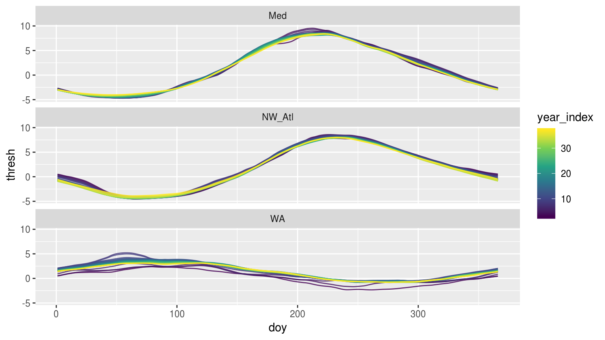
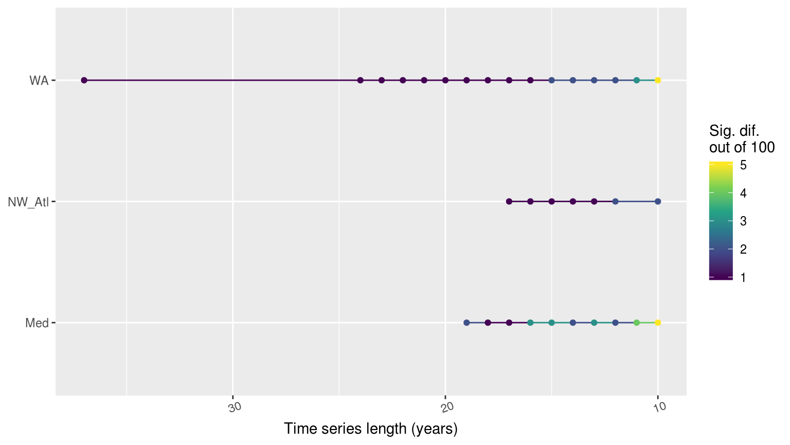
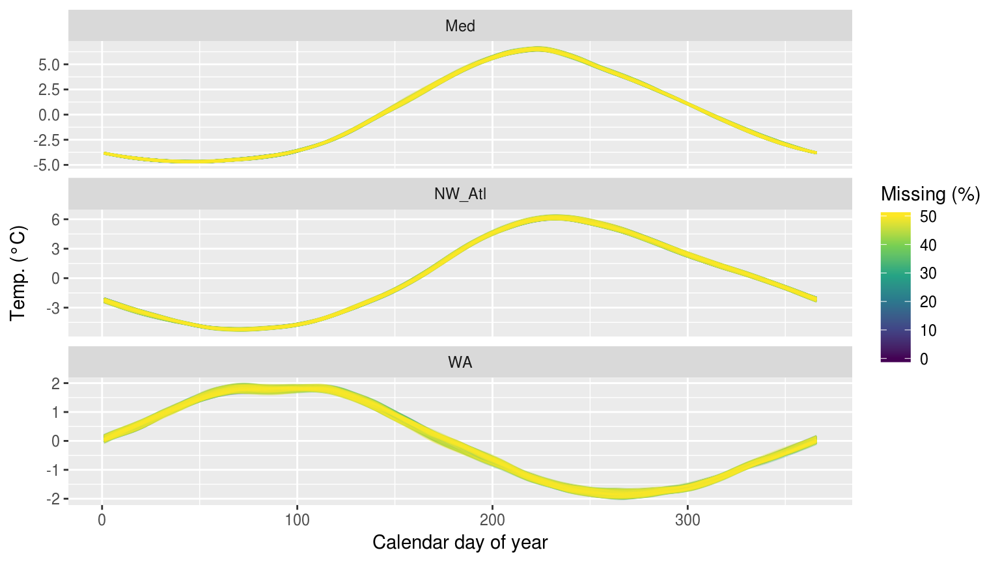
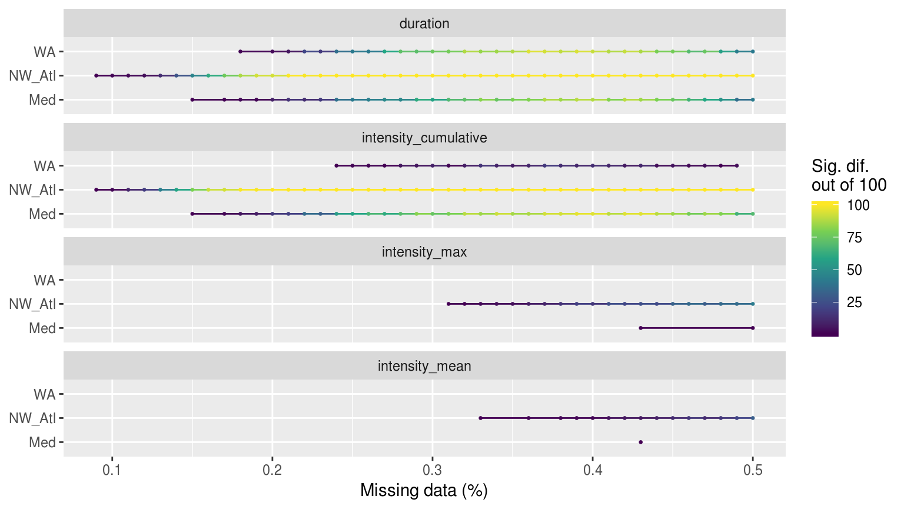
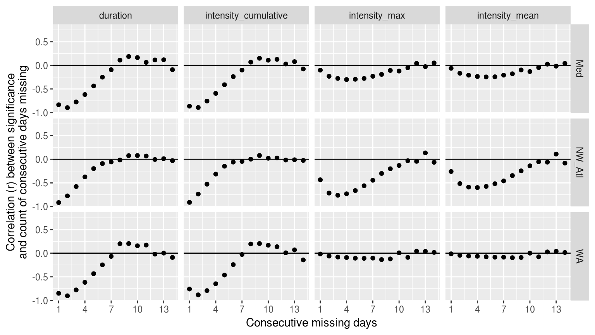
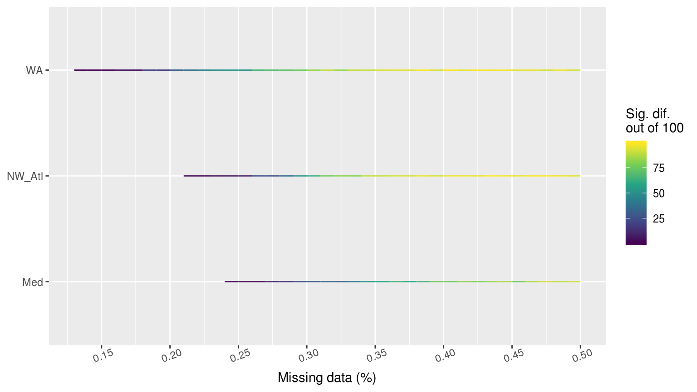
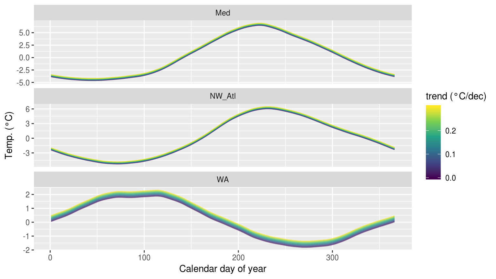
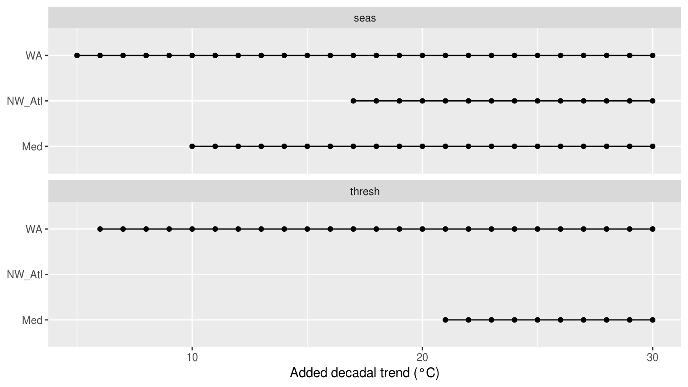

```{r global_options, include = FALSE}
knitr::opts_chunk$set(fig.width = 8, fig.align = 'center',
                      echo = TRUE, warning = FALSE, message = FALSE, 
                      eval = TRUE, tidy = FALSE)
```

1: Department of Oceanography, Dalhousie University, Halifax, Nova Scotia, Canada
2: Department of Biodiversity and Conservation Biology, University of the Western Cape, Bellville, South Africa
3: CSIRO Marine and Atmosphere, Hobart, Tasmania, 7000, Australia


# Abstract

It is now known that marine heatwaves (MHWs) have been increasing in duration and intensity globally for decades however, there are many coastal, sea,  and ocean regions where our ability to accurately detect MHWs is uncertain. This is because a MHW is defined relative to a reference climatological period and in a range of location this has not been sampled continuously for 30 or more years, as is the standard recommendation. Here we investigate the effect that short time series duration, missing data, or linear decadal temperature trends may have on the accurate detection of MHWs. We show that time series as short as 10 years could still be used to estimate the duration and intensities of MHWs, but the accurate identification of temperature thresholds was impaired when fewer than ~25 years of data were used. MHWs have also been categorized based on their intensity, and we show that the frequency of categories of MHWs detected in time series missing 15 -- 25% of their data did not differ significantly from those detected in complete time series. Linear decadal trends as low as 0.10°C/dec could lead to inaccurate creation of seasonal climatologies, but this did not impact accurate MHW detection. The percentage of missing data in a time series was determined to have the most dramatic effect on the accurate detection of MHWs. We suggest best practices to improve the accuracy of MHW detection with imperfect time series using specific case studies of three notable MHWs from the literature.  
(249 words)


# Introduction

The idea of hot seawater being problematic is not a novel concept. We have known for decades, perhaps millennia, that seemingly transient hot water occurrences in the ocean could result in major impacts [e.g. @Salinger2016]. It was perhaps due to our lack of ability to track and record ocean temperatures globally that researchers did not begin to quantify the effects of anomalously warm seawater temperatures until the early 1980s when research into ENSO began [e.g. @Philander1983]. It was not until the 2000's that much work began to be done on the direct consequences of this hot water on ecosystems [e.g. @Garrabou2009]. Later still was the development of a globally utilised definition for these events that enjoyed wide-spread use. 

- Marine heatwaves occur
- Global observations allow a definition to be used, requiring good data
    - Some regions not well observed
- How do we cope with data challenges?

<!-- Nice, but not needed for your argument here. -->
<!-- The now commonly used @Hobday2016 definition for anomalously warm seawater temperature events, better known as marine heatwaves (MHWs) has allowed researchers around the world to directly compare events in very different environments for the present as well as the past. A follow up to this definition has now also introduced a category naming convention [@Hobday2018] that makes the application of this definition even more useful for transdisciplinary work. -->


# Defining marine heatwaves

A widely used definition for MHWs is "a prolonged discrete anomalously warm water event that can be described by its duration, intensity, rate of evolution, and spatial extent." [@Hobday2016]. Accompanying this definition is an algorithm that produces a suite of metrics that researchers may use to define the events and to effectively compare them against known ecological/financial impacts using an ever-growing list of statistical tools. A full explanation for these metrics may be found in Table 2 of @Hobday2016.

It is perhaps due to the ease and interoperability of this methodology that it has seen rapidly increasing use across marine sciences (cite?). This has introduced a new series of meta-issues in that different groups often depart from the default use of the algorithm for MHW detection in varying degrees (e.g. cite Spanish paper), or simply use entirely different methodologies [e.g. @Frolicher2018] while referring to the @Hobday2016 definition. This has given rise to concerns over best practices. What should a group do if faced with a particular challenge, such as wanting to use an _in situ_ collected time series of bottom temperatures that is only 15 years old? Or perhaps using a time series that is collected by hand during only weekdays, and not weekends? These are real issues that need answers.

Here we explore additional issues that can improve the use of use of the @Hobday2016 and @Hobday2018 methodology, and ensure that results remain comparable if performed with data that do not meet the minimum requirements that were first proscribe. An advantage of the @Hobday2016 and @Hobday2018 approach was the development of supporting code in a range of platforms. The MHW algorithm is currently available in python (<https://github.com/ecjoliver/marineHeatWaves>), R [@Schlegel2018], and MATLAB [@Zhao2019]. For this analysis we compared the R and python default outputs, how changing the arguments affected the default outputs, as well as a comparison of the other functionality provided between the two languages. While some style differences exist between the added functionality of the languages, the core climatology outputs are identical to within < 0.001 °C per day-of-year (doy). An independent analysis of the Python and MATLAB results also confirmed that they were functionally identical (pers. com. Zijie Zhao; MATLAB distribution author).


# What are robust data for detecting heatwaves?

There are several issues that can arise in trying to implement the defintions proposed in @Hobday2016 or @Hobday2018. The first concerns minimum data period for developing a climatology. @Hobday2016 suggests 1) 30 years and 2) no missing days. There are a number of methods within the already existing arsenal of tools that can address these concerns and we will lay them out here. The second issue is to determine the effect of long-term trends on the accurate detection of events. @Oliver2018 have shown how dominant the climate change signal can be in the detection of events and we seek to quantify this effect here.

First we have summarised some of the commonly used data products for the detection of MHWs and potential issues they may have. This information will allow the reader to more readily determine which fixes may be most useful for them.

- _I'm thinking that the data summary section should be removed or severely shortened_  
    - _Perhaps just talk about the three broad categories and what their advantages and disadvantages are_

Outlined here in a series of three tables are a non-exhaustive list of the products currently available for work with MHW detection. The advantages, disadvantages, and any known issues are listed with the products in addition to a brief summary of their meta-data and where they may be downloaded. The products are broken up into three broad categories: remotely sensed data, reanalysis data, and _in situ_ data.

- _In each table we can list the most common products that may be used at this time advantages would obviously be things like global vs. point location (satellite), inclusion of subsurface data (reanalysis), resolution of coastal processes (in situ). Disadvantages around interpolation, resolution, missing data, time series length, etc…_
- _Maybe insert a table here that lists all of the data sets that might be potentially useful, if we can overcome some of their limitation; in the table, also mention each product’s limitations (e.g. too short, too many NAs, etc.)_
- _Many gridded daily SST products are available that may make them more useful closer to the coast (but see Smit et al., 2013; etc.) due to their finer grid size (1-4km refs.), but the data do not yet cover a full 30 year period_
- _The finer resolution AVHRR data (4km) also run from 1981, but it is dodgy here off the coast of SA, and probably also elsewhere_
- _The various flavours of MODIS data are okay, but the time series only runs from the early 1990s. They are better near the coast, but not perfect._ 
- _More recently people have started using the MUR and G1SST data, which at a resolution of 1 km resolve details in the coastal areas and look promising, but have not really been widely validated_
- _Many of these newer data sets are close to around 10 years long._


Table 1:
|Remotely sensed data |Description |Spatial res. |Temporal res. |Start date |End date |Update |Advantages |Disadvantages |Solutions |Download |
|------------------|------------------------------------------------|----------|--------|--------|-------|------|------|------|-------|-------|
|NOAA OISST |The NOAA optimally interpolated SST (OISST) data [@Reynolds2007] are currently the most commonly used for the detection of MHWs. This product is corrected with the use _in situ_ collected data, which are also used to fill gaps in the record. |0.25° (~25 km) global grid |Daily |1981-09-01 |Near real-time |Gapless global 30+ year time series |Course resolution and interpolation of data over gaps. Not suitable for use within one pixel of a coastline. |... |www.ncdc.noaa.gov/oisst/data-access |
|MODIS AQUA | 
|MODIS TERRA | 
|AVHRR Pathfinder v5.2 | 
|G1SST | 
|MUR |


Table 2:
|Reanalysis data |Description |Spatial res. |Temporal res. |Start date |End date |Update |Advantages |Disadvantages |Solutions |Download |
|------------------|------------------------------------------------|----------|--------|--------|-------|------|------|------|-------|-------|
|BRAN |


- _We also have a whole collection of in situ coastal (nearshore) water temperatures that are from 10-20 years long, but growing, and we would like to use them for MHW detection._
- _e.g. the IMAS FAC records around Tassie we used in the Tasman Sea MHW paper -- many of those were 5-10 years in length_
- _The thing with coastal data is simply that they might suffer from being too short, or have too many NAs, or both. Solving it requires an understanding of the data properties rather than knowing that it is in situ_
- _We don’t want an exhaustive list of data products but rather the “types” of data products available and the pros/cons in the context of MHW analyses._


Table 3: This table differs from the preceding two in that types of products are presented here rather than specific products. This is because the meta-data for differing _in situ_ products will vary widely, but the issues facing them do not. So listed here are the broad types of _in situ_ data one is likely to encounter and what to expect from them.
| _In situ_ data |Description |Spatial res. |Temporal res. |Start date |End date |Update |Advantages |Disadvantages |Solutions |Download |
|------------------|------------------------------------------------|----------|--------|--------|-------|------|------|------|-------|-------|


## Reference time series 

- _Show the time series from NOAA OISST; Western Australian (WA), NW Atlantic (NW Atl), and Mediterranean (Med) (henceforth reference time series)_ 
- _Maybe include a description of the MHWs as detected from the “default algorithm parameters”, which we can then use as a reference for the rest of the work (i.e. sensitivity to time series length, missing values, etc…)_
- _ A table shown below should include all aspects/statistics of the time series (e.g. range of seasonal signal) that will come out as imporatant in the results section._

```{r}

```

<!-- We see in the table above that the three default time series currently being used all have decadal trends much higher than the global average of ~0.1°C. -->


# Do I have enough data?

The titular question of this section is what this paper seeks to answer. If one refers back to the previous section 'Available data for MHW detection', it is clear that there are many data products that currently exist with which we may very comfortably answer with 'yes'. But there would be little reason in writing a paper about something everyone in marine science already likely knows, so in the following sub-sections we will highlight the most fundamental challenges presented by the use of sub-optimal time series, and outline how we ensured that one could still use these data in the face of these challenges.

It must be pointed out that the context of the question of having a suitable amount of data is benchmarked to the category classification system from @Hobday2018. Specifically we wanted to know how the different time series deficiencies affected our ability to detect MHWs of the varying categories. This is because category I MHWs are very common, and it seems from the literature that neither category I or II events are very important ecologically/financially. This means it is not of overwhelming concern if some time series deficiencies prevent the accurate detection of these smaller events. It is therefore the accurate detection of the category III and IV events that we use as a guiding principle for evaluating the severity of the time series deficiencies, and the usefulness of the methods proposed to counteract them.

To more clearly explain the effects that the following variables have on MHWs we have broken up the concept of a MHW into three parts. The first are the climatologies of theMHW, which are the seasonal signal and the 90th percentile threshold. The second part is the event itself, which is defined by the metrics in Table 2 of @Hobday2016. The final part of a MHW is the count of the different categories of events.


## Assessing the effect of time series duration

The duration of a time series may affect the detection of marine heatwaves by negatively affecting the creation of an accurate daily climatology relative to which the events can be detected. A climatology serves two main roles (WMO, 2017); 1) it serves as a ‘benchmark’ relative to which past and future measurements can be compared, and against which anomalies can be calculated, 2) it reflects the typical conditions likely to be experienced at a particular place at a particular time. The WMO technical guidelines (WMO, 2016) stipulate that daily climatologies (which they call ‘climate normals’) must be based on the most recent 30-year period that ends on an even decade (currently 1981-2010). 

What we aim to determine here is at what number of years do the detected MHWs in shortened time series become significantly different from the 30 year standard. This is done by first removing the long-term linear trends in the data before systematically shortening the reference time series one year at a time, down to a minimum of ten years, before comparing the results.

In order to make this analysis more robust, the above methodology was also performed on each reference time series with the order of the years randomly re-sampled and recombined 100 times. We chose this method instead of creating artificial time series with comparable auto-correlation structures as it ensured that the large historical MHWs present in the reference time series could still be accounted for as these are an important reason why these time series were chosen.

The differences in the seasonal signals and 90th percentile thresholds from different time series lengths were determined with Kolmogorov-Smirnov (KS) tests. This test is designed specifically to look for differences in distributions between two sets of data and so is considered a better test for difference between climatologies than a test of central tendency (e.g. t-test or ANOVA). 

The default MHW detection algorithm creates a range of metrics. Four of these are generally used in published literature: duration, cumulative intensity, mean intensity, and maximum intensity. The difference caused by time series length for these metrics was determined with an ANOVA, and the pairwise relationships were examined with a post-hoc tukey test. Because it would violate the assumption of equitable sample sizes were we to compare events from a 30 year time series against say a 10 year time series, we have limited the length of the shortest time series being compared to 10 years. This was so that we could still have a reasonable sample size to draw from as we could only compare the results from time series of varying lengths for years in which they overlapped.

To determine if the count of different categories of events differed we used pairwise chi-squared tests of each time series against the control 30 year length. To further determine which category counts were most responsible for the observed differences between time series lengths the standardised residuals from the tests were used. 


## Assessing the effect of missing data

Some remotely sensed products suffer from ‘gappiness’ that results from NAs being introduced. This may be due to cloud cover, the presence of sea ice, unsuitable sea states, etc., which become more prevalent at smaller scales, particularly nearer the coast. Some products smooth out these influences, but this results in smoothed SST fields that mask some of the small-scale spatial variation in surface temperatures. Other times they rely on blending with data from other products, which may have its own suite of consequences. This is why the use of imperfect _in situ_ collected time series may still be encouraged in certain situations. These data are however also prone to large gaps and so the problems these data face with regards to accurate event detection are generally uncertain. 

What we wanted to know was how much random missing data could be accommodated before the MHW results began to differ, and what the effect of consecutive missing data was in addition to simply how much data overall were missing. Regardless if the missing data were random or not. In order to simulate missing data in the de-trended reference time series we randomly removed 0 -- 50% of the data in 1% steps. This was repeated 100 times to account for the random nature of this process. We also investigated what the effect of large non-random gaps (e.g. sea ice coverage) would be.

The quantification of the effect of missing data on the results used the same statistical tests as for time series length. The difference being that the full 37 years of data were used for each test and the control time series were now those with 0% missing data.


## The role of long-term trends

It is known that the long-term secular trend in a time series may be the controlling factor for the detection of events. To quantify what this effect may be we started with the de-trended reference time series and added decadal trends of 0.00 -- 0.30°C/dec in 0.01°C steps.

The difference this caused in the results was quantified with the same tests as for length and missing data. The control time series were those with no added trend.


# Results

- _The following section is still a rough outline of the results thus far._
- _I've kept it as brief as possible rather giving links to the full analyses elsewhere._
- _I'm thinking that in the interest of saving space I will need to think of a way to combine most of these figures and tables as they share a similar methodological structure._ 


## Time series duration

- _The detailed results are [here](https://robwschlegel.github.io/MHWdetection/articles/time_series_duration.html)_


### Seasonal signals and thresholds

- Seasonal signals tend to differ with fewer than 20 years of data
- Thresholds differ with fewer than 25 years
- This occurs much more quickly in the `WA` time series



![Figure 2: Line plots showing the results of pairwise Kolmogorov-Smirnoff tests for the seasonal signals (top panel) and 90th percentile thresholds (bottom panel) from the same time series at differing lengths. The colour of the line shows how many times out of 100 re-samples that the climatologies were significantly different from the control. The dotted vertical line denotes the 30 year climatology mark, against which all othe climatologies were compared. If no re-samplings were significantly different this is shown with a grey line.](../docs/articles/time_series_duration_files/figure-html/KS-clims-1.png)

- _It may be better to show these results with a table as it would be easier to see when exactly the climatologies begin to differ._


#### Alternative climatologies

- _I am thinking about removing this section due to time constraints._

- The investigation into the effect of [different methods](https://robwschlegel.github.io/MHWdetection/articles/Climatologies_and_baselines.html) for calculating climatologies showed that, given certain circumstances, the accuracy of the threshold climatologies could be improved.

1. The 7 basis function Fourier has very little variation over the entire year among the 100 simulations, but the dip during summer months is missed.
2.  The 11 basis function Fourier gets some of the dip, but there is slightly more variation between the 100 simulations.
3. The MHW function's climatology captures the profile as it deviates away from a sinusoidal patterns better, but there is a large amount of variation between the randomisations.


### Events

- The length of a time series had a negligible effect on the MHW metrics with only a few significant differences occurring at shorter time series
- The post-hoc Tukey tests showed that no individual parings were significantly different
- This is a surprising result
    - _I double checked this but will triple check it_
    

### Categories

- The length of a time series had little effect on the count of categories
    - The largest count was for the `WA` at a time series length of 10 being significantly different from 30 years only 5 times out of 100.




## Missing data

- _The detailed results are [here](https://robwschlegel.github.io/MHWdetection/articles/missing_data.html)_

### Consecutive missing days

- The count of consecutive missing days increased with greater percentages of random missing data
    - The proportion of smaller consecutive missing days was logarithmic to the larger consecutive missing days


### Climatologies

- Missing data had little perceptible effect on seasonal signals and produced only a few random significant differences with no clear pattern



- The effect of missing data on the threshold was obvious and usually significant


- Significant differences in thresholds from missing data differed
- `WA` different at only 10% missing data
- `NW_Atl` different at ~23%
- `Med` not different until ~29%


- The count of 1 -- 3 consecutive missing days is a possible predictor of the threshold being significantly different from control


### Events

- The time series proved to be remarkably resilient to missing data affecting the max and mean intensity of events
    - There was little effect, with missing percentages as large as 40% being the most sensitivity observed
- The `WA` was the most resilient
- The `NW_Atl` was the most sensitive
- Duration (and therefore cumulative intensity) became significantly different with as little as 10 -- 20% missing data



- Consecutive missing days appear to be a decent predictor for duration (and int. cum.) but not mean/max intensity




### Categories

- The `WA` was the most sensitive to missing data affecting category count, with the `Med` least sensitive
- The range of missing data leading to significant differences in category count was ~15 -- 25%



- _Currently not showing the results of non-random missing data here._
    - _My thinking is to bring it up in the best practices section when the use of linear interpolation to deal with missing data is show cased._


## Long-term trends

- _The detailed results are [here](https://robwschlegel.github.io/MHWdetection/articles/trend.html)_


### Climatologies

- Adding decadal trends had a large effect on the `WA` seasonal signal



- Adding decadal trends had a smaller effect on the thresholds, which is interesting


- Depending on the time series, no amount of added decadal trend may make a difference




### Events

- No significant differences were detected


### Categories

- The counts of categories did not differ significantly either


# Discussion

The fact that there is such a broad range across the results shows that one must always exercise caution when using a sub-optimal time series. But that with a healthy dose of caution there is still much that can be done to ameliorate the issues outlined in the results.

<!-- ## Do I have enough data? -->


## Time series length

- This is problematic 


## Missing data


## Long-term trends


## Decision tree


## Best practices

* _After the investigation into the aforementioned topics has been completed, a series of best practices for dealing with these issues may be discussed_
- _We can provide guidelines about which suitable shorter time series data can/should be used for MHW detection, and how to select the best climatology creation method_
* _Ideally these could also be retroactively worked into the R/Python code to provide them as options for users_
* _Below is to be given an itemised list that readers could easily consult_


### De-trending

- _How/should a researcher account for a decadal trend when it is not technically possible to calculate one from a short time series?_
    - _It could be advised that determining the trend from a nearby longer time series that shows good agreement could be done._


### Linear interpolation

- _This is probably going to prove to be a silver bullet for most of the missing data issues_

### Climatology estimation methods

- _For shorter time series, it might be better to use a more sinusoidal approximation of the climatology that captures the trend for the bulk of the year, but loses something around the deviations away from the perfect sine form_ 
- _Alternatively, if those deviations are seen as important features that need to be accounted for, then using the MHW climatology is probably better, but at the expense of overall accuracy_
- _We can provide an expert interpretation of the pros and cons of each method, and the technical tools to perform each method (through the code itself)_
- _That then leaves the user with expert recommendations and can make their own informed choice, given what they know about their data and what they want to prioritise/consider in their own analysis_
- _Also assess the effect of systematic varying windowHalfWidth and smoothPercentile and studying the outcomes for the three time series lengths_
- _Fourier transform climatologies/harmonic regression_
- _Analysis of short-duration, high resolution gridded SSTs_
- _It might be useful to show that in regions where events (at a certain threshold) can be detected in the dOISST data, that they also are present in the higher-res, shorter duration SST products_ 
- _Then we can show that in some scenarios the hi-res, short time series additionally capture some events that are not present in the OISST data due to its coarse spatial grid size_
    - _compare reference time series vs. other co-located SST data_
    - _compare in special conditions where events may be expected, but are not present in the dOISST data due to constraints resulting from it not being of high enough resolution; e.g. in upwelling regions, embayments, etc_
    

### Non-daily data

- Some datasets come in weekly or monthly temporal resolution
    - These may be useful when daily data have too many NAs (e.g. AVHRR Pathfinder, MODIS, and MERIS data)
    - Can we use weekly and monthly data? 
    - What has been done along these lines?
    - The way the R code is currently set-up, it will try to correct non-daily data into a daily time series with many gaps 
    - The problem then is that a time series will generally have about 1 MHW per year by virtue of the 90th percentile threshold being used
    - So if one uses monthly data it may be rather alarming to see that an area is experiencing month long MHWs every year
    - The quick answer that comes to mind is to then play around with the 'pctile' argument and see at what percentile threshold do different levels of super-daily data begin to match up with the 90th percentile on daily data
    - Meaning, when there really is a month long MHW detected in daily data at a 90th percentile threshold, what must a comparable threshold be so that monthly data only 'shows' a MHW at comparable times


## Pitfalls

* _What has been found that should be taken into consideration when using the above best practices_


# Conclusions

* _What are the main take away messages_

- It looks like one can be pretty indelicate in choice of time series.
- The MHW algorithm appears to be remarkably robust!


# References
