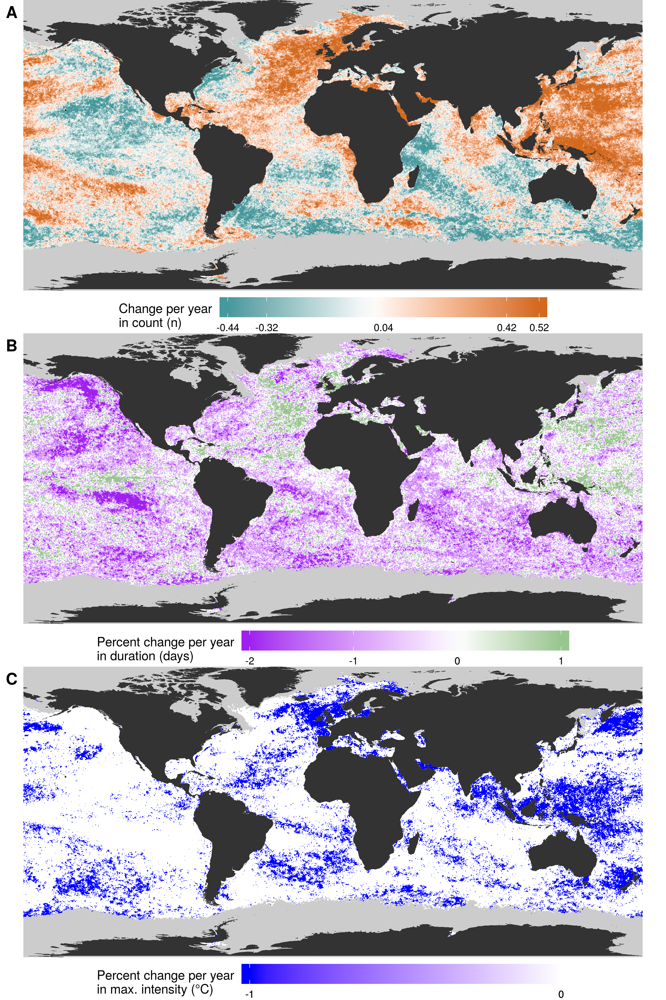
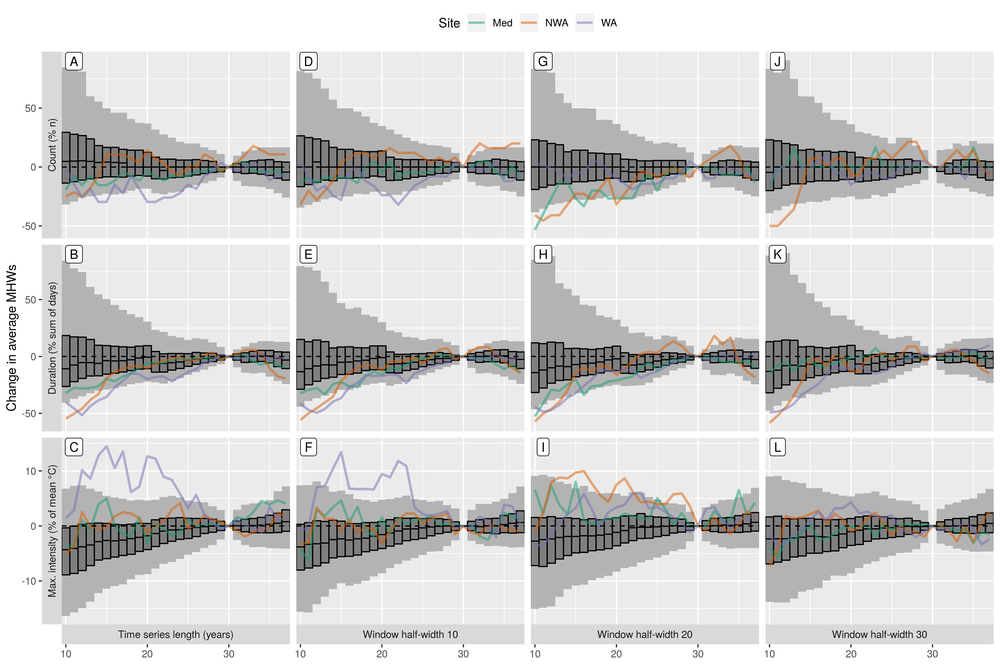
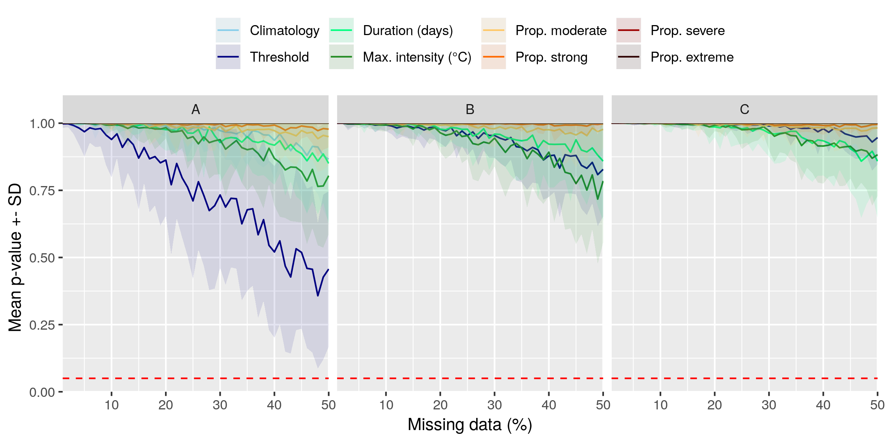

```{r global_options, include = FALSE}
knitr::opts_chunk$set(fig.width = 8, fig.align = 'center',
                      echo = TRUE, warning = FALSE, message = FALSE, 
                      eval = TRUE, tidy = FALSE)
```

1Department of Oceanography, Dalhousie University, Halifax, Nova Scotia, Canada  
2Department of Biodiversity and Conservation Biology, University of the Western Cape, Bellville, South Africa  
3CSIRO Oceans and Atmosphere, Hobart, Tasmania, 7000, Australia

__*Correspondence:__  
Robert Schlegel  
robert.schlegel@dal.ca  

__Keywords: marine heatwaves, sea surface temperature, sub-optimal data, time series length, missing data, decadal trend__

# Abstract

Marine heatwaves (MHWs), or prolonged periods of anomalously warm sea water temperature, have been increasing in duration and intensity globally for decades. However, there are many coastal, oceanic, and polar regions where our ability to detect MHWs is uncertain due to the unavailability of high quality data. Here we investigate the effect that short time series length, missing data, or linear decadal temperature trends may have on the detection of MHWs. We show that MHWs detected in time series as short as 10 years did not have durations or intensities significantly different from events detected in the standard length 30 year time series, but the accurate identification of temperature thresholds could be impaired when fewer than 15 years of data were used. We also show that the output of the MHW algorithm for time series missing less than 20% data did not differ appreciably, and that this could be increased to 40% when gaps were filled with linear interpolation. Linear decadal trends of 0.05 -- 0.15°C/dec or greater could lead to inaccurate creation of seasonal climatologies, but this did not impact accurate MHW detection. The percentage of missing data in a time series was determined to have the largest effect on the detection of MHWs, but was also the easiest to correct for. Time series length had less of an effect on MHW detection, but was more difficult to correct for. We provide suggestions for best practices to improve the accuracy of MHW detection with sub-optimal time series on a global scale and specific case studies of three notable MHWs from the literature.  
<!-- (260 words) -->


# Introduction
  
The idea of locally warm seawater being problematic is not a novel concept. We have known for decades that seemingly transient warm water occurrences in the ocean could result in major impacts [e.g. @Baumgartner1992; @Salinger2016]. The study of the effects of anomalously warm seawater temperatures began in earnest in the early 1980's when research into the ENSO phenomenon began [e.g. @Philander1983]. After the 1980's, researchers began noticing that warm water events were becoming more frequent and problematic, but it wasn't until 2018 that this was demonstrated with global observations [@Oliver2018]. 

In order to quantify the increased occurrence and severity of these events it was necessary to develop a methodology that would be inter-comparable for the entire planet. This was accomplished in 2016 after the International Working Group on Marine Heatwaves (marineheatwaves.org) initiated a series of workshops to address this issue [@Hobday2016]. This definition for anomalously warm seawater events, known as marine heatwaves (MHWs), has seen wide-spread and rapid adoption due to ease of use and global applicability. One problem with this algorithm that has not yet been addressed is the assumption that a researcher has access to the highest quality data available when detecting MHWs. In the context of MHW detection, a 'high quality' time series is spatio/temporally consistent, quality controlled, and at least 30 years in length [Table 3 in @Hobday 2016]. While not stated explicitly in @Hobday2016, a 'high quality' time series should also not have any missing days of data. To avoid contention on the use of the word 'quality', time series that meet the aforementioned standards are referred to here as 'optimal', whereas those that do not meet one or more of the standards are referred to as 'sub-optimal'. Another unresolved issue with the @Hobday2016 algorithm, which does not fall within the requirements for optimal data, is how much of an effect the long-term (secular) trend in a time series may have on the accurate detection of MHWs.

<!-- With the advent of remotely-sensed sea surface temperature (SST) products in the early 1980's, oceanographers and other marine stake holders were given a synoptic view of the worlds oceans, no longer relying on ship-based measurements and stationary moorings to infer temperature for meso-scale features and larger.  -->

Most remotely-sensed data, and more recently output from ocean models and reanalyses, consist of over 30 years of data and utilise statistical techniques to fill gaps in their time series from a number of environmental and technical sources. This means that these data are considered optimal for MHW detection. An excellent reference for the remotely-sensed products currently available, as well as their strengths & weaknesses, is Table 12.3 in @Harrison2019. Even though remotely-sensed data products are considered optimal, they still have other issues (e.g. land bleed and incorrect data flagging) and so it may be recommended that for coastal applications researchers utilise sub-optimal data, such as sporadically collected _in situ_ time series [@Smit2013; @Hobday2016].

<!-- RWS: Check that the @Harrison2019 reference came out correctly -->

<!-- RWS: Also need to discuss how the different satellite products provide different resolutions, but at the cost of time series length. -->

<!-- Coastal areas are often poorly sampled yet are the most susceptible to the impacts of MHWs [e.g. @Smale2019] so it is necessary to address the issues that using these data may have on the detection of MHWs. -->

<!-- RWS: Perhaps a bit here about the increased heat content of sub-surface waters and how that makes MHWs below the surface appear to last longer. -->

This paper seeks to understand the limitations the use of sub-optimal data impose on the accurate detection of MHWs. Of primary interest are three key challenges: 

1) The use of time series shorter than 30 years
2) The use of temporally inconsistent (missing data) time series
3) The use of time series in areas with large long-term temperature trends

We will use a combination of reference time series from specific locations and global data to address these issues. The effects of the three sub-optimal data challenges on the detection of MHWs are quantified in order to provide researchers with the level of confidence they may express in their results. Where possible, best practices for the correction of these issues are detailed.


# Defining marine heatwaves

The definition used in this paper for a MHW is "a prolonged discrete anomalously warm water event that can be described by its duration, intensity, rate of evolution, and spatial extent." [@Hobday2016]. This qualitative definition is quantified with an algorithm that calculates a suite of metrics. These metrics may then be used to characterise MHWs and to effectively compare them against known ecological/financial impacts. The calculation of these metrics is made possible by first determining the mean and 90th percentile temperature for each of the 366 calendar day-of-year (doy) in a time series. The mean doy temperatures, which also represent the seasonal signal in the time series, provide the expected baseline temperature whose daily exceedance is used to calculate the intensity of MHWs. The 90th percentile doy temperatures serve as the threshold that must be exceeded for 5 or more consecutive days for the anomalously warm temperatures to be classified as a MHW and for the calculation of the MHW metrics to begin.

In this paper we will focus on the two metrics that most succinctly summarise a MHW. The first metric, _duration (days)_, is defined as the number of days that the temperature remains at or above the 90th percentile threshold without dipping below it for more than 2 consecutive days. The duration of an event may be used as a measurement of the chronic stress that a MHW may inflict upon a target species or ecosystem [e.g. citations needed]. The second metric, _maximum intensity (°C)_, is the single warmest day during the event and is calculated by subtracting the mean doy temperature on that day from the recorded temperature. This metric may be used as a measurement of acute stress [e.g. citations needed]. A third metric, _cumulative intensity (°C)_, will also be used in this paper to determine the 'largest' MHW in a time series (see Methods). This metric represents the sum of temperature anomalies over the duration of the MHW and is comparable to the degree heating days metric used in coral reef studies [citation needed]. There are many other MHW metrics and the full explanation for them may be found in Table 2 of @Hobday2016. 

<!-- @Hobday2018 extended the MHW definition to include a categorisation scheme based on the intensity of an event. These categories were: I Moderate, II Strong, III Severe, and IV Extreme. The category of an event is determined by how many times the maximum intensity of the MHW is a multiple of the difference between the mean and 90th percentile doy temperatures (Figure 1). For example, if the difference between the mean and 90th percentile doy temperatures on the warmest day of a MHW is 1.5°C, and the temperature recorded on that warmest day was 3°C warmer than the mean doy temperature for that day, this would be considered a category II (Strong) MHW. Were the maximum temperature to be recorded at 4.5°C, this would be classified as a category III Severe MHW. To provide a more robust category quantification of a MHW, the categories are also calculated for each day of the event to provide a proportion of the days during which the MHW was within each of the categories. See Table 2 in @Hobday2018 for further examples. -->

The @Hobday2016 MHW definition has been developed for python (<https://github.com/ecjoliver/marineHeatWaves>), R [@Schlegel2018], and MATLAB [@Zhao2019]. Before beginning the analysis proposed here, we compared the R and python default outputs, assessed how changing the arguments affected the results, and compared the other functionality provided between the two languages. While some style differences exist between the added functionality of the languages, the core climatology outputs are identical to within < 0.001 °C per day-of-year (doy). An independent analysis of the Python and MATLAB results also confirmed that they were functionally identical (pers. com. Zijie Zhao; MATLAB distribution author).

<!-- Due to the availability, ease of use, and interoperability of this methodology it has seen rapid uptake across marine sciences [@Hobday2018], although other definitions have been used [e.g. @Frolicher2018].  -->

<!-- The increased use of the @Hobday2016 and @Hobday2018 methodologies has introduced a new series of meta-issues in that different groups often depart from the default use of the algorithm for MHW detection in varying degrees [e.g. Darmaraki2019, Guillen2019], or simply use entirely different methodologies [e.g. @Frolicher2018] while referring to the @Hobday2016 definition. -->

<!-- What should researchers do if faced with a particular challenge, such as wanting to use a daily collected _in situ_ time series of bottom temperatures that is only 15 years long? Are results significantly different when using a time series that is collected by hand during only weekdays, and not weekends (29% missing data)? Or to that end, is it even possible to use a time series with only one temperature value per week (86% missing data)? -->

<!-- Here we explore methods that can improve the use of the @Hobday2016 and @Hobday2018 methodology, ensuring that results remain comparable if performed with data that do not meet the minimum requirements of 30 years length that were first suggested, and data with large proportions of missing values.  -->


# What are optimal data for detecting marine heatwaves?

When working with outliers in a time series, such as MHWs, it is important that the quality of the data are high [citation needed]. @Hobday2016 stated that high quality data, referred to here as 'optimal', used for the detection of MHWs should meet the following criteria: 

1) A time series length of at least 30 years 
2) Quality controlled
3) Spatially and temporally consistent
4) Be of the highest spatial and temporal resolution possible/available
5) _In situ_ data should be used to compliment remotely sensed data where possible 

Whereas the authors did not specifically state that time series must not contain large proportions of missing data, it can be inferred from the aforementioned requirements. Another issue affecting the accurate detection of MHWs not discussed in @Hobday2016 is the prsence of long-term trends in a time series. @Oliver2018 have shown how dominant the climate change signal can be in the detection of MHWs and we seek to quantify this effect here.

A time series with a sub-optimal length may impact the detection of MHWs by negatively affecting the creation of the daily climatology relative to which MHWs are detected in two primary ways. The first is that with fewer years of data to draw from, the presence of an anomalously warm or cold year will have a larger effect on the climatology than with a sample size of 30 years. The second cause is that because the world is generally warming [@IPCC2014], the use of a shorter time series will almost certainly introduce a warm bias into the results.

The climatology derived from a time series serves two main roles [@WMO2017]; 1) it serves as a 'benchmark' relative to which past and future measurements can be compared, and against which anomalies can be calculated, 2) it reflects the typical conditions likely to be experienced at a particular place at a particular time. The WMO Guide to Climatological Practices [@WMO2011] stipulate that daily climatologies (which they call 'climate normals') must be based on the most recent 30-year period that ends on a complete decade (currently 1981 -- 2010). It is from this WMO guideline that the optimal length of time series for MHW detection was derived.
<!-- RWS: Check that the WMO citations come out correctly. May want to rather include this reference as a footnote as is done in Hobday2016 -->
<!-- RWS: Also, this may no longer be useful. Or at least it may need to be rewritten to better reflect how clim base periods are used in the methods. -->
<!-- RWS: Will probably want to say how, when one has fewer than 30 years of data, one should just use the whole period. -->

Some remotely sensed products suffer from 'gappiness' that result in missing data being introduced. This may be due to cloud cover, the presence of sea ice, unsuitable sea states, etc., which become more prevalent at smaller scales, particularly nearer the coast. Some products smooth out these influences, but this results in smoothed sea surface temperature (SST) fields that may mask small-scale spatial variations in surface temperatures. Remotely sensed products may also fill gaps by blending with data from other products, which may have its own suite of consequences. It is also known that coastal SST pixels from remotely-sensed products may have biases in excess of 5°C from _in situ_ collected data [@Smit2012]. This is why the use of imperfect _in situ_ collected time series may still be encouraged for coastal applications. These data are however also prone to large gaps and so the problems these data face with regards to accurate event detection are also uncertain. It must be stressed here that the best practices for working wwith sub-optimal data presented in the Discussion section do not address the issues that remotely sensed data have near coastlines.


# Methods

<!-- RWS: Somewhere in here it needs to be stated that the focus event used in the three reference time series is actually the one from literature, and not the one from the last 10 years of data. -->

To quantify the effects that time series length, missing data, and long-term trends have on MHW detection we will focus on the two outputs created by the MHW detection algorithm:  
  
1) The climatologies derived from the daily SST records, which include both the seasonally-varying mean and 90th percentile threshold. 
    - These are not a part of the MHWs themselves, but are necessary for their detection.
2) The MHW events, which are defined by the metrics given in Table 2 of @Hobday2016.  
    - We focus here on the duration (days) and maximum intensity (°C) metrics as the primary two decriptors of a MHW.
    - Only the results for MHWs in the final 10 years of data (2009 -- 2018) are used to allow for roughly equal sample sizes across all tests.
    
<!-- 3) The proportion of days of the event that are within the different categories. -->
    <!-- - These are a more qualitative result that may be more applicable to a broader audience. -->

We then use the following three questions to frame the results:  
  
1) How sub-optimal may a time series become before any of the above items are significantly different from those calculated with an optimal time series?  
    - For example, how short may a time series be before the climatology becomes significantly different from the same climatology derived from the full 30 year time series?  
2) What amounts of uncertainty are introduced into the results from the increasingly sub-optimal data?
    - For example, when 20% of a time series is missing how much might the duration of a MHW be effected compared to that same MHW when detected in a time series missing no data?
3) Are the uncertainties introduced by sub-optimal data the same/similar everywhere in the world, or do they differ based on some observable pattern/known oceanographic feature(s)?
    - For example, when a time series has a long-term trend of 0.2°C/dec in an eastern boundary upwelling system (EBUS), does the effect this have on the maximum intensity of the events differ form the same trend in a time series in a western boundary current (WBC)?

To answer these three questions we will use the remotely sensed NOAA OISST dataset [@Reynolds2007, @Banzon2016]. This daily remotely-sensed global SST product has a 1/4 degree spatial resolution with the first full year of sampling being 1982. These data are interpolated where possible against a database of _in situ_ collected temperatures so that the final product does not have any spatial or temporal gaps. Before being used in this study each time series (pixel) is de-trended before beginning to control for the sub-optimal challenges. This de-trending is performed by fitting a simple linear model to each time series and removing the residuals from the data. This must be performed so that we may control for the effects of time series length and decadal trend separately. Once de-trended, each time series is treated to the suite of sub-optimal controls (see following sub-sections) and the focus output itemised above is extracted. In order to ensure as much consistency as possible across all test results, the climatology base period used will be the entire duration of the time series, and not the 30 year standard recomended by the WMO. See Appendix 1 for the difference between the focus results when using a 30 year base period vs. a 37 year base period.

To answer the first question the outputs of the MHW detection algorithm from the time series with different sub-optimal challenges will be compared against the same optimal reference time series (i.e. 30 year length, no missing data, no long-term trend) with a pairwise post-hoc Kruskal-Wallis test [@Siegel1988]. This non-parametric test looks for differences between the central tendency of a control and a series od comparison sets of data, providing the probability (_p_-value) that the sets of data have been drawn from the same pool. It was necessary to use a non-parametric test because we cannot ensure that the data being compared are always normally distrubted or have a similar count of observations. We think that the inclusion of a _p_-value in this way is important to frame the results, but are not using an arbitrary _p_-value threshold to reject a null hypothesis that the outputs from the sub-optimal data are different from the optimal data because testing for null hypotheses in this way is becoming increasingly discouraged [@Wasserstein2019]. That being said, we will still highlight comparisons that generate a _p_-value of 0.05 or less. 

The second question will be answered by quantifying the amount of uncertainty that the sub-optimal tests introduce into the results by calculating the percent of change that the results undergo from the control (optimal) time series as the data become more sub-optimal. This precentage in change will be performed on the mean of the climatologies, the MHWs detected in the final 10 years of data, and in the change in th metrics of the single largest MHW. No significance test is used here, rather the range of change in these values is shown in order to provide a benchmark against which one may decide how much change is too much. 

The answer to the third question builds on the answer to the second by looking at how the changes that sub-optimal data introduce into the results look spatially around the globe.

The answers to the first two questions will be visulalised with the three reference OISST time series from @Hobday2016. These time series are taken from the coast of Western Australia (WA; Figure 1A), the Northwest Atlantic Ocean (NWA; Figure 1B), and the Mediterranean Sea (Med; Figure 1C). These time series are used here for ease of reproducibility and because they each contain a MHW that has been the focus of multiple publications. 

<!-- ![Figure 1: The focus marine heatwaves (MHWs) from the three reference time series A) Western Australia, B) Northwest Atlantic, and C) Mediterranean. The various thresholds for the different MHW categories are shown as grey dotted lines and the proportions of the MHW within each category are filled with the corresponding colours seen in the legend at the top of the figure. Each panel is centred around the peak date of the focus MHW. The peak date is further highlighted by a dark green vertical segment. The beginning and end of each event are demarcated with light green vertical segments.](../LaTeX/fig_1.png) -->

<!-- We have used the category classification system from @Hobday2018 to benchmark our tests of data utility for MHW detection. Specifically we wanted to know how the different time series challenges affected our ability to detect different categories of MHWs. This is because category I MHWs are very common, and it seems from the literature that neither category I or II events are very important ecologically/financially. This means it is not of overwhelming concern if some time series deficiencies prevent the accurate detection of these smaller events. It is therefore the accurate detection of the category III and IV events that we use as a guiding principle for evaluating the severity of the time series deficiencies, and the usefulness of the methods proposed to counteract them. -->

The following three sub-sections describe how the three sub-optimal time series tests will be controlled for. 


## Controlling for time series length

There are currently 37 complete years of data available in the NOAA OISST dataset (1982 -- 2018). In order to determine the effect that time series length has on the focus output we will systematically shorten each time series one year at a time from 37 years down to 10 years (2009 -- 2018), before running the MHW detection algorithm. The focus outputs (climatologies, event metrics, and largest event) for each one year step for each of the time series will then be compared against the output from the optimal 30 year version of that same time series as outlined above.

In order to ensure equitable sample sizes we will only be comparing the MHW metrics and categories for events detected within the last 10 years of each test as this is the period of time during which all of the different tests overlap. This is also why we have limited the shortening of the time series lengths to 10 years, so that we could still have a reasonable sample size to draw from. 

Because the lengths of the time series were being varied, and were usually less than 30 years in length, it was also necessary that the climatology periods vary likewise. To maintain as much consistency as possible across the results we used the full range of years within each shortened time series to determine the climatology. For example, if the time series had been shortened from 37 to 32 years (1987 -- 2018), the 32 year period was used to create the climatology. If the shortened time series was 15 years long (2004 -- 2018), this base period was used. The control time series were those with a 30 year length ending in the most recent full year of data available (1989 -- 2018). Note that due to necessity this differs from the climatology period of 1982 -- 2011 that would mostly closely match the WMO standard.

The _a-priori_ fix proposed to address the issue of short time series length is to use a different climatology estimation technique. The option currently available within the MHW detection algorithm is to expand the window half width used when smoothing the climatology. Other techniques, such as harmonic regression/Fourier analysis, would have a similar effect but are not used here in favour of the @Hobdat2016 methodology. It is beyond the scope of this paper to compare every possible climatology calculation technique.


## Controlling for missing data

In order to determine the effect of random missing data on the focus outputs, each time series had 0 -- 50% of its data removed in 1% steps before running the MHW algorithm on each step. The optimal time series against which the others are compared will be the same time series with 0% missing data.

The _a-priori_ fix for the issue of missing data in the time series is to linearly interpolate over any gaps. There are many methods of interpolating (imputing) gaps in time series, such as spline interpolation, but we choose linear interpolation here due to its speed, simplicity, and the lack of assumptions it imposes on the data. It is beyond the scope of this paper to account for every possible method of interpolation however; we will also count the lengths of the gaps over which data are interpolated in order to show at how many consecutive mising days interpolation begins to fail.


## Controlling for long-term trends

To quantify the effect of long-term (secular) trends on the focus outputs we added linear decadal trends of 0.00 -- 0.30°C/dec in 0.01°C steps to each time series. The difference this caused in the outputs was quantified with the same tests as for length and missing data. The optimal time series used for control were those with no added trend (e.g. 0.00°C/dec).

There is no proposed _a-priori_ method to correct for the added linear decadal trend in these data as this would be simply not to add it. Rather it is proposed that the relationship between the slope of the added trend and the results it has on the focus outputs be documented to determine if a predictable relationship may be used to correct the results _post-hoc_.


# Results

## Time series length

Shortening the lengths of the time series had a noticeably negative effect on the comparability of the focus outputs, with the climatology outputs affected the most  (Figure 2).  

<!-- Changing the length of a time series lowered the mean probability (_p_-value) from the 100 re-sampled tests for each reference time series, but was accompanied by a high level of variance.  -->

<!-- ![Figure 2: The results from Kolmogorov-Smirnov (KS) tests on the similarity of the outputs from the MHW algorithm with optimal data against sub-optimal time series of differing lengths. The climatology outputs are shown in blue, the event metrics in green, and the category proportions in yellow-red. The solid lines show the mean _p_-value from the tests on the 100 re-sampled time series for each step. The coloured ribbons show one standard deviation (SD) in the _p_-values for each step. The results for each reference time series are A) Western Australia (WA), B) Northwest Atlantic (NWA), C) Mediterranean (Med). The x-axis shows the length of the time series being compared against the 30-year (optimal) data. The y-axis shows the range of mean _p_-values from 1.0 (exact same) to 0.0 (completely different), with a horizontal dashed red line at _p_=0.05 (statistically significantly different). Any mean values at or below the _p_=0.05 line are highlighted with red squares.](../LaTeX/fig_2.png) -->

With the exception of the Western Australia (WA) time series we see that there is no point at which any of the outputs from the MHW algorithm on shortened time series became significantly different from the 30 year control time series. The WA time series, which is characterised by its large inter-annual variability, only shows significantly different threshold climatologies on average when 14 years of data or fewer are used (Figure2A). The seasonal climatology does not differ significantly on average until 11 years of data or fewer are used.
<!-- RWS: Need to have more of a think about what to do with reporting on the seasonal & threshold climatologies. -->

It is important to note that increasing the climatology period longer than 30 years has almost as rapid an effect on creating dissimilar outputs as using fewer years of data does. This was an unexpected result that stresses the importance of adhering to the WMO standard as closely as possible to ensure the comparability of results. 

Looking at the effect that shortening time series length has on the duration and maximum intensity of the largest MHW from each reference time series we see that both values tend to decrease (Figure 3). This is because the shortening of a time series tends to increase the mean climatology, so the shorter a time series becomes, the lower the maximum intensity and shorter the duration of the MHWs become relative to the increasing mean climatology (Figure 3DH). We also see that the Western Australia (WA) MHW is always being divided into at least two or more separate events due to the rising mean climatology (Figure 3A). The Mediterranean (Med) MHW isn't affected much by changes in time series length as this MHW has a much more even rise and fall above the 90th percentile threshold (Figure 1C).

<!-- ![Figure 3: The effect of the three tests (columns) on the MHW metrics and count of events (rows). Each panel has three lines, one for each of the reference time series, shown in the legend at the bottom of the figure. These are the original data, not the randomly re-sampled time series. The lines track the change of just one metric for the focus MHWs seen in Figure 1 as the data are made increasingly sub-optimal, as shown along the x-axes. The y-axes show the unit of measurement for each metric. The top row, "count (event)" shows if the MHW has been divided up into multiple smaller MHWs due to changes in the values along the x-axes.](../LaTeX/fig_3.png) -->

The gently increasing maximum intensities caused by increasing the lengths of the time series were also generally seen to occur throughout the oceans (Figure 4). The median rate of change caused by increasing time series length from 10 to 30 years is seen to be 0.5% per year. This means that, on average, a MHW detected in a 10 year time series will have a maximum intensity about 10% cooler than a MHW detected in a 30 year time series. This is a very small margin and shows the robustness of the MHW detection methodology. We also see areas of decreasing MHW maximum intensity in most of the Southern Ocean, some parts of the open ocean in the Pacific and Atlantic, as well as in the Arctic. 

Remember that the long-term trend in these data were not removed beforehand so it is not surprising that increasing the length of the time series into the past (where the data are cooler on average) will reduce the mean climatology and therefore increase the maximum intensity of the detected event. The relationship between warming or cooling maximum intensity and decadal trends in temperature (i.e. climate change) is significant (_p_-value < 0.001, R^2 = 0.33). We also see that areas with perennial ice coverage, and western boundary currents (WBCs), tend to show greater rates of change. This is likely due to these areas having larger amounts of variance, in addition to a stronger decadal warming trend.

<!--  -->

Looking at the effect of time series length on the duration of MHWs around the globe (Figure 5) we see a similar pattern to the effect on maximum intensity (Figure 4). The median increase is 1.4% per year over the duration of the MHW detected with 10 years of data. This is not surprising and supports the observation for maximum intensity.

<!--  -->

The _a priori_ fix proposed for shorter time series, that of creating a smoother seasonal signal, created results with more similar overall days of MHWs per year, but all of the focus results were less similar than without applying the fix (results not shown; RWS: Could include as an Appendix if desired). This happened because the over smoothing of the seasonal signal prevents the detection of the smaller MHWs in the time series while inflating the size of the larger MHWs. A larger issue causd by short time series is the amount that the centre of the climatology increases or decreases, more so than the increase in variability caused, which additional smoothing seeks to address. This is not something that can be controlled for _a-priori_ and is better controlled for in a _post-hoc_ manner along the same lines as the proposed fix for decadal trends (see below).


## Missing data

The effects of missing data on the focus outputs were the largest of the three tests (Figure 6). Whereas the changes in time series length may affect the climatologies more rapidly (Figure 2), increases in missing data affect the MHW metrics and the focus MHW much more (Figure 2; Figure 6). The outputs most affected are the threshold climatology and the duration of the MHWs. The maximum intensities of the MHWs are also affected, but at 50% missing data these did not become significantly different from the control time series. The seasonal signal was affected very little by large proportions of missing data.

<!-- ![Figure 6: The results from Kolmogorov-Smirnov (KS) tests on the similarity of the outputs from the MHW algorithm with optimal data against sub-optimal time series with increasing percentages of missing data. The climatology outputs are shown in blue, the event metrics in green, and the category proportions in yellow-red. The solid lines show the mean _p_-value from the tests on the 100 re-sampled time series for each step. The coloured ribbons show one standard deviation (SD) in the _p_-values for each step. The results for each reference time series are A) Western Australia (WA), B) Northwest Atlantic (NWA), C) Mediterranean (Med). The x-axis shows the percent of missing data in the time series being compared against the complete (0%; optimal) data. The y-axis shows the range of mean _p_-values from 1.0 (exact same) to 0.0 (completely different), with a horizontal dashed red line at _p_=0.05 (statistically significantly different). Any mean values at or below the _p_=0.05 line are highlighted with red squares.](../LaTeX/fig_6.png) -->

The effect of random missing data on the single focus MHWs from the three reference time series are very jagged because the missing data at each step was only calculated once. This was done intentionally to highlight the range that this randomness can have on the results as compared to the changes in length (Figure 3ADH). The effect that missing data can have on the MHW metrics depends largely on the shape of the MHW, meaning the area above the threshold climatology and below the observed anomaly. The WA event has a very pronounced peak (Figure 1A), so when larger proportions of data are missing we see how likely it becomes that this peak is not being recorded. The maximum intensity measured in the control time series is 6.5°C, but we see that because very few days of this MHW were so intense, increasing proportions of missing data become more likely to remove these large values. In the NWA event we also see a jagged effect from missing data, though less than the WA event, this is also because of the peak in temperature for this event. The effect on the Med event is the least pronounced because the event is more even in its exceedance of the 90th percentile threshold. Missing data does not begin to have an appreciable effect on the Med event until there is an excess of 35% of the data missing.

The duration of the MHWs are all negatively impacted by missing data, with the longer duration MHW (WA) impacted much more than the shorter (NWA and Med) MHWs (Figure 6E). Even though the decrease in duration due to missing data is very rough, we see that it follows a linear trend and can therefore be predicted for within a certain range of error.

For the two shorter MHWs the increase in missing data never divides the event up into more than two separate MHWs (Figure 6B). The contiguity of the WA event however is affected greatly by missing data. With just 5% of the data in the time series missing this event was divided into 5 separate events. As missing data increased the count of the divided events tended to also increase up until 27% missing data. At that point the event began to be divided into fewer events again, not because they were forming back together, but rather because there was now not enough contiguous days in exceedence of the threshold to detect a MHW.

The _a priori_ fix proposed for this issue, the linear interpolation of missing data, was very effective and could potentially allow for the use of time series missing up to 50% of their data (Figure 7), assuming that there is not so much missing data that the period of time during a MHW that one may be wanting to study/isolate is completely missing.

<!--  -->

<!-- RWS: A bit here about consecutive mssing days of data and how that interferes with linear interpolation.-->

<!-- Figure 8: Consecutive missing days of data and how that relates to the efficacy of linear interpolation.-->


## Long-term trends

When adding a linear trend to the time series we see that the climatologies deviate at an exponential rate (Figure 9). The effect an added decadal trend had on the other outputs of the MHW algorithm was roughly linear, and never produced results significantly different from the control time series.

<!-- ![Figure 9: The results from Kolmogorov-Smirnov (KS) tests on the similarity of the outputs from the MHW algorithm with optimal data against sub-optimal time series with increasingly larger linear decadal trends added to them. The climatology outputs are shown in blue, the event metrics in green, and the category proportions in yellow-red. The solid lines show the mean _p_-value from the tests on the 100 re-sampled time series for each step. The coloured ribbons show one standard deviation (SD) in the _p_-values for each step. The results for each reference time series are A) Western Australia (WA), B) Northwest Atlantic (NWA), C) Mediterranean (Med). The x-axis shows the decadal trend added to the time series being compared against the flat (0 added trend; optimal) data. The y-axis shows the range of mean _p_-values from 1.0 (exact same) to 0.0 (completely different), with a horizontal dashed red line at _p_=0.05 (statistically significantly different). Any mean values at or below the _p_=0.05 line are highlighted with red squares.](../LaTeX/fig_8.png) -->

Adding linear long-term trends never caused the focus MHW to be dissected into multiple events (Figure 9), but the duration of the events were affected differently by the added linear trend. The Med shows practically no effect, the NWA has a very slight increase with a dramatic jump at an added trend of 0.04°C/dec, and the WA event sees a massive increase due primarily to one large jump at 0.42°C/dec. The effect that the linear trend has on the maximum intensity of each event is a simple linear function of the decadal trend and where in the time series the event occurs. The slope for the increase in maximum intensity for the Med MHW is more shallow than the other two because this MHW occurred in 2003, as opposed to 2010 (WA) and 2012 (NWA). 

Given the relationship between decadal trends and the focus outputs seen above, one may be able to apply a _post-hoc_ correction to one's results if the decadal trend in a given area is known. 
<!-- RWS: Need to flesh this out. Maybe include a figure or table. -->

## Best practices

<!-- RWS: A section, with a table, that shows the best practices for dealing with sub-optimal data. -->

# Discussion

An investigation into the effects that sub-optimal data have on MHW results revealed that there are thresholds within which the outputs of the MHW detection algorithm will remain comparable to results generated by optimal data. Times series longer than about 15 years in length should cause little concern regarding the reliability of the climatologies that are derived from them. The length of a time series has less of an effect on the detected MHW metrics, with MHW detected with 10 years of data not being appreciably different from those detected with 30 years. An unexpected result was that increasing the length of a time series longer than 30 years reduced the probability that the outputs would be comparable by as much as shortening the time series did. This means that the common (often unspoken) assumption that using 30 years of data is the same as using > 30 years of data is incorrect. In other words, the 30 year length is often thought of as a minimum length needed to constrain the climatology but we have shown here that using a climatology period greater than 30 years may create outputs as different as using fewer than 30 years. It is therefore important to stress the adherence to the WMO standards for climatology periods as closely as possible, should one want one's results to be comparable to other studies. Increased smoothing of the climatologies derived from shortened time series was not an effective fix, in fact it made the results worse and we strongly recomend that the default climatology creation methodology in @Hobday2016 be adhered to.

The MHW algorithm proved to be resilient to missing data as long as there are not particularly large gaps (e.g. greater than a week at a time). Time series missing as much as 20% of their data may be used without much concern. Greater amounts of missing data could still be used with some caution as the outputs of the MHW algorithm did not differ significantly on average when as much as 50% missing data were present. It is not however recommended to consider the outputs of time series with this much missing data to be comparable to outputs from an optimal time series. This is because the number of events detected in time series with more then 30% missing data differ greatly. The mean MHW metrics may be comparable between the time series, but the actual events detected will be different. A simple correction for missing data in a time series is to linearly interpolate over the gaps. It is not however recommended to do this with more than 40% missing data as this begins to dramatically distort the algorithms ability to compute metrics for individual MHWs. If this is necessary to do for some reason, the resultant MHWs for the entire time series may still be used to infer the chronic and acute stress that organisms may face in a given location, but any individual events detected should not be taken as an accurate recording.

The decadal trends in times series have a large effect on the creation of climatologies. That being said, normal ranges of decadal trends (e.g. 0.1 -- 0.3C/dec) do not have an appreciable effect on MHW metrics. Furthermore, the effect of decadal trends are predictable and when taken with time series length and the year in which an event in question has occurred it is possible to infer a correction for the maximum intensity. The effect this has on the duration can also be worked out by considering the general rise (or fall) in the mean climatology and how that may engulf neighbouring days or even other events. A concept to consider with the increase in duration from added decadal trends is that the temperatures in the time series increase "faster" than the 90th percentile threshold. So as the decadal trend increases, a given MHW effectively spreads outwards. If the rate of onset/decline for the MHW was more gradual (e.g. the NWA event) it will increase in duration more rapidly. If the rate of onset/decline was more rapid (e.g. the Med event), then the duration of the MHW won't change much with a larger decadal trend. If MHWs have close neighbouring MHWs then as they spread outward they may encounter each other and merge into a single event. This reduces the overall count of the MHWs detected in a time series while increasing the mean duration of the events detected.

<!-- RWS: Need to address how the increased heat content of sub-surface waters makes MHWs below the surface appear to last longer or be larger etc. -->


# Conclusions

The acceptable sub-optimal data limits, the amount of uncertainty they introduce into the results, and their proposed corrections are as follows:  
  
1) Time series length:
  - A length of 15 years will produce acceptible climatologies
  - A length of 10 years produces accurate MHW metrics   
  - The uncertainty introduced into results by time series length is difficult to predict...
  - Smoothing the climatology before detecting MHWs makes the results **worse**, not better, and should not be done  
2) Missing data:
  - More than 20% missing data begins to affect the treshold climatology, while the seasonal climatology is impervious to missing data up to 50%
  - Missing data up to 40% does not have an appreciable effect on the collective durations and max intensities of MHWs in a time series
  - The detected metrics for single large MHWs are no longer reliable with more than 20% missing data
  - Linear interpolation is an excellent fix for missing data up to 40%, assuming one does not have periods of consecutive missing data in excess of five days  
3) Long-term trends
  - Trends under 0.10°C/dec did not create appreciably different climatologies, though these began to deviate quickly
  - MHW metrics were not affected meaningfully at long-term trends under 0.30°C/dec
  - If one knows the decadal trend present in a study area it is possible to correct for the max intensity of a MHW by subtracting the year of occurrence as a function of the slope present in the data 
  - For example, if the decadal trend in an area is 0.30°C/dec, and the peak date of an event is in the 25th year of a 30 year time series (83% of the length) then the the impact of the decadal trend on the max intensity will roughly be: 0.3*0.83 = 0.25(°C)

We have shown here that researchers must not shy away from the use of sub-optimal time series when the situation calls for it, such as coastal research or sub-surface analyses. Time series length may have an unpredictable effect on MHW results, but this may be corrected for within reason, and we have shown that time series lengths as short as 10 years are still useful for MHW research. Any shorter than 10 years however and the relationship between time series length and the effect on MHW metrics becomes too unpredictable to provide any corrections with confidence. Missing data has a larger effect on MHW detection, but is less of a concern as linear interpolation can largely fix the challenges this creates, up to a threshold of 40% missing data. Lastly, the effect of long-term trends on MHW detection are the most predictable and when taken with time series length may be corrected for with a reasonable degree of certainty. The MHW detection algorithm is very robust and we have shown here that one may be confident in the inter-comparability of one's results when using time series within a generous range of sub-optimal data challenges.


# Conflict of Interest

The authors declare that the research was conducted in the absence of any commercial or financial relationships that could be construed as a potential conflict of interest.


# Author Contributions

The majority of the text and figures were produced by RWS. A large portion of an early version of the text and a number of initial figures were produced by AJS. AJH, ECJO, and AJS provided several rounds of comments on the manuscript as it was developed. RWS synthesised the comments and uploaded the manuscript.


# Funding

This research was supported by National Sciences and Engineering Research Council of Canada Discovery Grant RGPIN-2018-05255.


# Acknowledgements

The authors currently have no acknowledgements to make.


# Data Availability Statement

The code and datasets generated for this study may be found at https://github.com/robwschlegel/MHWdetection.


# Figure legends

Figure 1: The focus marine heatwaves (MHWs) from the three reference time series A) Western Australia, B) Northwest Atlantic, and C) Mediterranean. The various thresholds for the different MHW categories are shown as grey dotted lines and the proportions of the MHW within each category are filled with the corresponding colours seen in the legend at the top of the figure. Each panel is centred around the peak date of the focus MHW. The peak date is further highlighted by a dark green vertical segment. The beginning and end of each event are demarcated with light green vertical segments.  

Figure 2: The results from Kolmogorov-Smirnov (KS) tests on the similarity of the outputs from the MHW algorithm with optimal data against sub-optimal time series of differing lengths. The climatology outputs are shown in blue, the event metrics in green, and the category proportions in yellow-red. The solid lines show the mean _p_-value from the tests on the 100 re-sampled time series for each step. The coloured ribbons show one standard deviation (SD) in the _p_-values for each step. The results for each reference time series are A) Western Australia (WA), B) Northwest Atlantic (NWA), C) Mediterranean (Med). The x-axis shows the length of the time series (years) being compared against the 30-year (optimal) data. The y-axis shows the range of mean _p_-values from 1.0 (exact same) to 0.0 (completely different), with a horizontal dashed red line at _p_=0.05 (statistically significantly different). Any mean values at or below the _p_=0.05 line are highlighted with red squares.  

Figure 3: The effect of the three tests on the MHW metrics and count of events. Each panel has three lines, one for each of the reference time series, shown in the legend at the bottom of the figure. These are the original data, not the randomly re-sampled time series. The lines track the change of just one metric for the focus MHWs seen in Figure 1 as the data are made increasingly sub-optimal, as shown along the x-axes. The y-axes show the unit of measurement for each metric. The top row of panels, “count (event)” shows if the MHW has been divided up into multiple smaller MHWs due to changes in the values along the x-axes.  

Figure 4: Map showing the percent increase per year in the maximum intensity of the largest MHW detected in the most recent ten years of data when an increasing number of years of data are used for the calculation of the MHW.  

Figure 5: Map showing the percent increase per year in the duration of the largest MHW detected in the most recent ten years of data when progressively more years of data are used for the calculation of the MHW.

Figure 6: The results from Kolmogorov-Smirnov (KS) tests on the similarity of the outputs from the MHW algorithm with optimal data against sub-optimal time series with increasing percentages of missing data. The climatology outputs are shown in blue, the event metrics in green, and the category proportions in yellow-red. The solid lines show the mean _p_-value from the tests on the 100 re-sampled time series for each step. The coloured ribbons show one standard deviation (SD) in the _p_-values for each step. The results for each reference time series are A) Western Australia (WA), B) Northwest Atlantic (NWA), C) Mediterranean (Med). The x-axis shows the percent of missing data in the time series being compared against the complete (0%; optimal) data. The y-axis shows the range of mean _p_-values from 1.0 (exact same) to 0.0 (completely different), with a horizontal dashed red line at _p_=0.05 (statistically significantly different). Any mean values at or below the _p_=0.05 line are highlighted with red squares.  

Figure 7: The same information shown in Figure 6, but with the gaps introduced from the random missing data filled via linear interpolation before running the MHW detection algorithm.  

Figure 8: The results from Kolmogorov-Smirnov (KS) tests on the similarity of the outputs from the MHW algorithm with optimal data against sub-optimal time series with increasingly larger linear decadal trends added to them. The climatology outputs are shown in blue, the event metrics in green, and the category proportions in yellow-red. The solid lines show the mean _p_-value from the tests on the 100 re-sampled time series for each step. The coloured ribbons show one standard deviation (SD) in the _p_-values for each step. The results for each reference time series are A) Western Australia (WA), B) Northwest Atlantic (NWA), C) Mediterranean (Med). The x-axis shows the decadal trend added to the time series being compared against the flat (0 added trend; optimal) data. The y-axis shows the range of mean _p_-values from 1.0 (exact same) to 0.0 (completely different), with a horizontal dashed red line at _p_=0.05 (statistically significantly different). Any mean values at or below the _p_=0.05 line are highlighted with red squares.


# References
