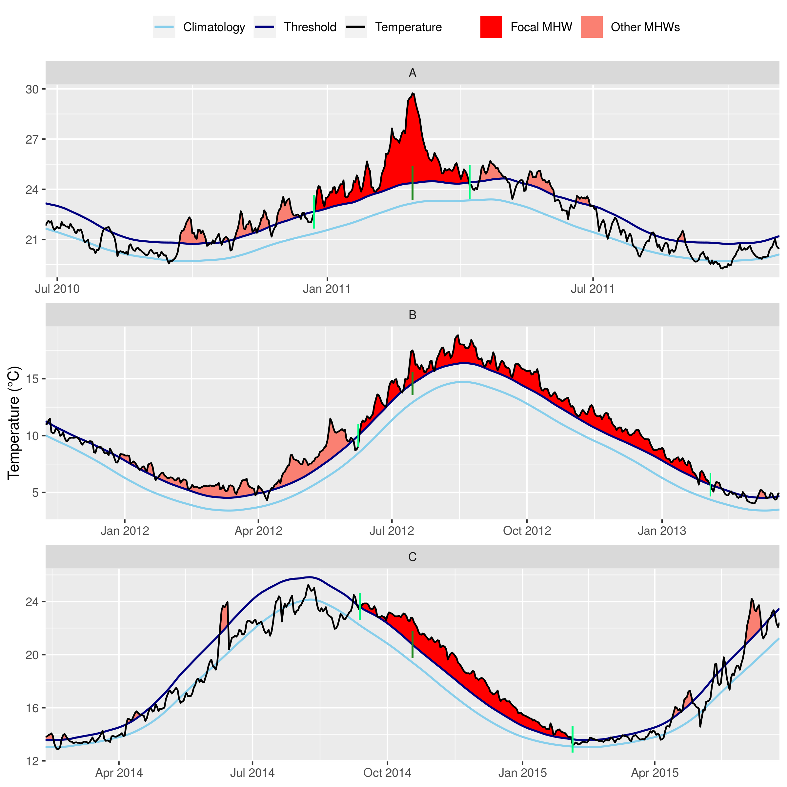
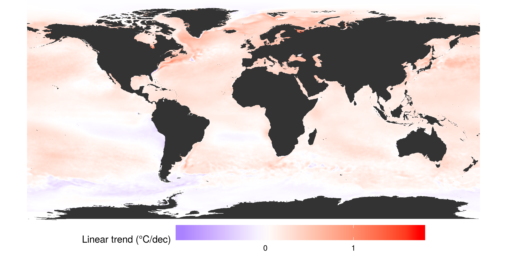
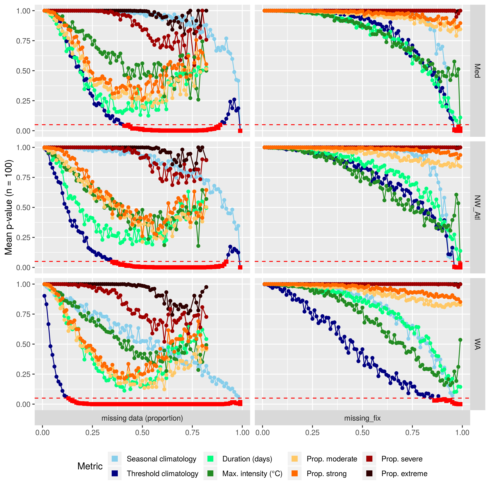

```{r global_options, include = FALSE}
knitr::opts_chunk$set(fig.width = 8, fig.align = 'center',
                      echo = TRUE, warning = FALSE, message = FALSE, 
                      eval = TRUE, tidy = FALSE)
```

1: Department of Oceanography, Dalhousie University, Halifax, Nova Scotia, Canada
2: Department of Biodiversity and Conservation Biology, University of the Western Cape, Bellville, South Africa
3: CSIRO Oceans and Atmosphere, Hobart, Tasmania, 7000, Australia


# Abstract

Marine heatwaves (MHWs), or prolonged periods of anomalously warm sea water temperature, have been increasing in duration and intensity globally for decades. However, there are many coastal, oceanic, and polar regions where our ability to detect MHWs is uncertain due to the unavailability of high-quality data. Here we investigate the effect that short time series length, missing data, or linear decadal temperature trends may have on the detection of MHWs. We show that MHWs detected in time series as short as 10 years did not have durations or intensities significantly different from the same events detected in a standard length 30 year time series, but the accurate identification of temperature thresholds could be impaired when fewer than 15 years of data were used. We also show that for time series missing less than 20% data, the intensity-based MHW categories did not differ significantly from those detected in complete time series. Linear decadal trends of 0.05 -- 0.15°C/dec could lead to inaccurate creation of seasonal climatologies, but this did not impact accurate MHW detection. The percentage of missing data in a time series was determined to have the largest effect on the detection of MHWs, but was also the easiest to correct for. Time series length had less of an effect on MHW detection, but was more difficult to correct for. We provide suggestions for best practices to improve the accuracy of MHW detection with sub-optimal time series on a global scale and specific case studies of three notable MHWs from the literature.  
(xxx words)


# Introduction
  
The idea of locally warm seawater being problematic is not a novel concept. We have known for decades that seemingly transient warm water occurrences in the ocean could result in major impacts [e.g. @Baumgartner1992, @Salinger2016]. The study of the effects of anomalously warm seawater temperatures began in earnest in the early 1980's when research into the ENSO phenomenon began [e.g. @Philander1983]. After the 1980's, researchers began noticing that warm water events were becoming more frequent and problematic, but it wasn't until 2018 that this was demonstrated with global observations [@Oliver2018]. 

In order to quantify the increased occurrence and severity of these events it was necessary to develop a methodology that would be inter-comparable for the entire planet. This was accomplished in 2016 after the International Working Group on Marine Heatwaves (marineheatwaves.org) initiated a series of workshops to address this issue [@Hobday2016]. This definition for anomalously warm seawater events, known as marine heatwaves (MHWs), has seen wide-spread and rapid adoption due to ease of use and applicability to any part of the globe. One problem with this algorithm that has not yet been addressed is the assumption that a researcher has access to the highest quality data available when detecting MHWs. In the context of MHW detection 'high quality' is a daily time series with no missing data that is at least 30 years in length. To avoid contention on the use of the word 'quality', time series that meet the aforementioned standard are referred to here as 'optimal', whereas those that do not meet some part of the standard are referred to as 'sub-optimal'.

<!-- With the advent of remotely-sensed sea surface temperature (SST) products in the early 1980's, oceanographers and other marine stake holders were given a synoptic view of the worlds oceans, no longer relying on ship-based measurements and stationary moorings to infer temperature for meso-scale features and larger.  -->

Most remotely-sensed data, and more recently output from ocean models and reanalyses, consist of over 30 years of data and utilise statistical techniques to fill gaps in the time series from a number of environmental and technical sources. This means that these data are considered optimal for MHW detection however, they still have issues (e.g. land bleed and incorrect data flagging) and so it may be recommended that researchers utilise sub-optimal data when possible, such as sporadically collected _in situ_ time series. Coastal areas are often poorly sampled yet are the most susceptible to the impacts of MHWs [e.g. @Smale2019] so it is necessary to address the issues that using these data may have on the detection of MHWs.

This paper seeks to understand the limitation of using sub-optimal data for the detection of MHWs. Of primary interest are three key challenges: 1) The use of short time series, 2) the use of time series with missing data, 3) the use of time series in areas with large long-term temperature trends. We will use a combination of reference time series from specific locations and global data to address these issues. The effects of the three sub-optimal data challenges on the detection of MHWs are quantified in order to provide researchers with the level of confidence they may express in their results. Where possible, best practices for the correction of these issues are detailed.


# Defining marine heatwaves

The definition used in this paper for a MHW is "a prolonged discrete anomalously warm water event that can be described by its duration, intensity, rate of evolution, and spatial extent." [@Hobday2016]. This qualitative definition is quantified with an algorithm that calculates a suite of metrics. These metrics may then be used to characterise MHWs and to effectively compare them against known ecological/financial impacts. The calculation of these metrics is made possible by first determining the mean and 90th percentile temperature for each of the 366 calendar day-of-year (doy) in a time series. The mean doy temperatures, which also represent the seasonal signal in the time series, provide the expected baseline temperature whose daily exceedance is used to calculate the intensity of MHWs. The 90th percentile doy temperatures serve as the threshold that must be exceeded for 5 or more consecutive days for the anomolously warm temperatures to be classified as a MHW and for the caluclation of the MHW metrics to begin.

In this paper we will focus on the two metrics that most succinctly summarise a MHW. The first metric, _duration (days)_, is defined as the number of days that the temperature remains at or above the 90th percentile threshold without dipping below it for more than 2 consecutive days. The duration of an event is the best single measurement of the chronic stress that a MHW may inflict upon a target sepcies or ecosystem. The second metric, _maximum intensity (°C)_, is the single warmest day during the event and is calculated by subtracting the mean doy temperature on that day from the recorded temperature. This metric is the best single representation of acute stress. There are many other MHW metrics and the full explanation for them may be found in Table 2 of @Hobday2016. 

@Hobday2018 extended the MHW definition to include a categorisation scheme based on the intensity of an event. These categories were: I Moderate, II Stong, III Severe, and IV Extreme. The category of an event is determined by how many times the maximum intensity of the MHW is a multiple of the difference between the mean and 90th percentile doy temperatures (Figure 1). For example, if the difference between the mean and 90th percentile doy temperatures on the warmest day of a MHW 1.5°C, and the temperature recorded on that warmest day was 3°C warmer than the mean doy temperature for that day, this would be considered a category II (Strong) MHW. Were the maximum temperature recorded at 4.5°C, this would then be classified as a category III Severe MHW. To provide a more robust qualificatin of a MHW, the categories are also calculated for each day of a MHW to provide a proportion of the days during which the event was within each of the categories.

An additional advantage in the use of the @Hobday2016 and @Hobday2018 approach is that it has been developed for python (<https://github.com/ecjoliver/marineHeatWaves>), R [@Schlegel2018], and MATLAB [@Zhao2019]. For this analysis we compared the R and python default outputs, assessed how changing the arguments affected the results, and compared the other functionality provided between the two languages. While some style differences exist between the added functionality of the languages, the core climatology outputs are identical to within < 0.001 °C per day-of-year (doy). An independent analysis of the Python and MATLAB results also confirmed that they were functionally identical (pers. com. Zijie Zhao; MATLAB distribution author).

<!-- Due to the availability, ease of use, and interoperability of this methodology it has seen rapid uptake across marine sciences [@Hobday2018], although other definitions have been used [e.g. @Frolicher2018].  -->

<!-- The increased use of the @Hobday2016 and @Hobday2018 methodologies has introduced a new series of meta-issues in that different groups often depart from the default use of the algorithm for MHW detection in varying degrees [e.g. Darmaraki2019, Guillen2019], or simply use entirely different methodologies [e.g. @Frolicher2018] while referring to the @Hobday2016 definition. -->

<!-- What should researchers do if faced with a particular challenge, such as wanting to use a daily collected _in situ_ time series of bottom temperatures that is only 15 years long? Are results significantly different when using a time series that is collected by hand during only weekdays, and not weekends (29% missing data)? Or to that end, is it even possible to use a time series with only one temperature value per week (86% missing data)? -->

<!-- Here we explore methods that can improve the use of the @Hobday2016 and @Hobday2018 methodology, ensuring that results remain comparable if performed with data that do not meet the minimum requirements of 30 years length that were first suggested, and data with large proportions of missing values.  -->




# What are optimal data for detecting marine heatwaves?

@Hobday2016 stated that optimal data for detecting MHWs have the following porperties: 1) the time series must be at least 30 years in length, 2) be quality controlled, 3) be of the highest resolution possible, and 4) _in situ_ data should be used to compliment remotely sensed data where possible. Whereas the authors did not specifically state that time series must not contain large proportions of missing data, it can be inferred from the aforementioned requirements. There are a number of methods within the already existing tools for detecting MHWs that can address these concerns and we will lay them out here. An issue not discussed in @Hobday2016 is the effect of long-term trends on the accurate detection of events. @Oliver2018 have shown how dominant the climate change signal can be in the detection of events and we seek to quantify this effect here.

A time series with a sub-optimal length may impact the detection of MHWs by negatively affecting the creation of the daily climatology relative to which MHWs are detected in two primary ways. The first is that with fewer years of data to draw from, the presence of an anomalously warm or cold year will have a larger effect on the climatology than with a sample size of 30 years. The second cause is that because the world is generally warming [@IPCC2014], the use of a shorter time series will almost certainly warm bias the results.

The climatology derived from a time series serves two main roles [@WMO2017]; 1) it serves as a 'benchmark' relative to which past and future measurements can be compared, and against which anomalies can be calculated, 2) it reflects the typical conditions likely to be experienced at a particular place at a particular time. The WMO Guide to Climatological Practices [@WMO2011] stipulate that daily climatologies (which they call 'climate normal') must be based on the most recent 30-year period that ends on a complete decade (currently 1981 -- 2010). It is from this WMO guideline that the optimal length for MHW detection was derived.

Some remotely sensed products suffer from ‘gappiness’ that result in missing data being introduced. This may be due to cloud cover, the presence of sea ice, unsuitable sea states, etc., which become more prevalent at smaller scales, particularly nearer the coast. Some products smooth out these influences, but this results in smoothed SST fields that mask some of the small-scale spatial variation in surface temperatures. Other times they rely on blending with data from other products, which may have its own suite of consequences. This is why the use of imperfect _in situ_ collected time series may still be encouraged in certain situations. These data are however also prone to large gaps and so the problems these data face with regards to accurate event detection are generally uncertain. 


<!-- # Do I have enough data? -->

# Methods

To quantify the effects that time series length, missing data, and long-term trends have on MHW detection we will focus on the following three outputs created by the MHW detection algorithm:
  
1) The climatologies derived from the daily SST records, which include both the seasonally-varying mean and 90th percentile threshold. 
    - These are not a part of the MHWs themselves, but are necessary fo their detection.
2) The MHW event itself, which is defined by the metrics given in Table 2 of @Hobday2016.  
    - We chose here to focus on only the duration (days) and maximum intensity (°C) metrics in order to keep the results manageable.
3) The proportion of days of the event that are within the different categories.
    - These are a more qualitative result that may be more applicable to a broader audience.

With these three focal items defined, we will then use the following three questions to frame the results:
  
1) How sub-optimal can data be before any of the above three items become significantly different from those calculated with an optimal time series? 
    - For example, how short may a time series be before the climatology becomes significantly different from the same climatology derived from the full 30 year time series?
2) What amounts of uncertainty are introduced into the results from the increasingly sub-optimal data?
    - For example, when 20% of data are missing, what should a user expect the standard error around the duration of a MHW to be compared to that same MHW when detected in a time series mising no data?
3) Are the error rates introduced by sub-optimal data the same/similar everywhere in the world, or do they differ based on some observable pattern/known oceanographic feature(s)?
    - For example, when the length of a time series is shortened to 10 years in an eastern boundary upwelling system (EBUS), does the effect this have on the maximum intensity of the events differ form the same shortening on a time series in a western boundary current (WBC)?

To answer these three questions we will use the remotely sensed NOAA OISST dataset [@Reynolds2007, Banzon2016]. This daily remotely-sensed global SST product has a 1/4 degree spatial resolution. The first complete year of data available is 1982, meaning that we must deviate slightly from the WMO standard for daily climatology creation by setting our reference period at 1982 -- 2011 unless otherwise noted. 

The first two questions posed above will be answered using the three reference time series from @Hobday2016. These time series are taken from the coast of Western Australia (WA; Figure 1A), the northwest Atlantic Ocean (NWA; Figure 1B), and the Mediterranean Sea (Med; Figure 1C). These time series are used here for ease of reproducibiltiy and because they each contain a MHW that has been the focus of multiple publications. For the third question posed above we will use the entire global NOAA OISST product.

The outputs of the MHW detection algorithm from the reference time series with different sub-optimal challenges will be compared against the same optimal reference time series (i.e. 30 year length, no missing data) with a Kolmogorov-Smirnov (KS) test. This test looks for differences in the continuous distribution of values between two sets of data, rather than testing for differences of central tendency (e.g. _t_-test or ANOVA), and provides a _p_-value that indicates the probability that the two distributions being compared have been drawn from the same pool of data. It was decided not to test for central tendency for two reasons; the first being that the assumption of normality for the values in the outputs was usually violated, and the second was that we do not want to know how sub-optimal data affect the central tendency of the results, but rather how they affect the distribution of the results. For example, does a 15 year time series produce a larger number of short events than a 30 year time series? To this end we are also not interest in rejecting a null hypothesis that the outputs from the sub-optimal data are the same as the optimal data based on a _p_-value of 0.05 or less. This is in part because testing for null hypotheses in this way is becoming increasingly discouraged [@Wasserstein2019], but also because we want to show what the probability is that results from a time sub-optimal time series may be different from an optimal time series.

Because it would not be a robust test of the effects of sub-optimal data on MHW detection to use only three time series in this way, the order of the years within each of the three reference time series were randomly re-sampled and recombined 100 times, ensuring that one of the re-samples maintained the original order of the reference time series. This 100 fold increase to the available dataset will allow for a better estimate of the error that sub-optimal data introduce into MHW detection. We chose this method instead of creating artificial time series with comparable auto-correlation structures as it ensured that the large historical MHWs present in the reference time series would still be used in the calculations as these are an important reason why these time series were chosen. 

Lastly, because the effects of time series length and long-term trends are to be quantified separately, it is necessary to de-trend the time series before beginning to control for the sub-optimal challenges. This de-trending is performed by fitting a simple linear model to each of the re-sampled time series and then removing it from the data. The following three sub-sections describe how the three sub-optimal time series challenges will be controlled for. 

<!-- We have used the category classification system from @Hobday2018 to benchmark our tests of data utility for MHW detection. Specifically we wanted to know how the different time series challenges affected our ability to detect different categories of MHWs. This is because category I MHWs are very common, and it seems from the literature that neither category I or II events are very important ecologically/financially. This means it is not of overwhelming concern if some time series deficiencies prevent the accurate detection of these smaller events. It is therefore the accurate detection of the category III and IV events that we use as a guiding principle for evaluating the severity of the time series deficiencies, and the usefulness of the methods proposed to counteract them. -->


<!-- ## Assessing the effect of time series length -->
## Controlling for time series length

<!-- Therefore, in order to isolate the effect of time series length on the detection of MHWs from the impact of a climate change signal, we removed the linear trends in the time series before investigating the effect that shortening the time series had. -->

There are currently 37 complete years of data available in the NOAA OISST dataset (1982 -- 2018). In order to determine the effect that time series length has on the three MHW detection algorithm outputs, we will systematically shorten each of the 100 re-sampled reference time series, one year at a time from 37 years down to 10 years (2009 -- 2018), before running the MHW detection algorithm. The three different outputs (climatologies, event metrics, and categories) for each one year step for each of the re-sampled time series will then be compared against the output from the optimal 30 year version of that same time series using a KS test.

In order to ensure equitable sample sizes we will only be comparing the MHW metrics and categories for events detected within the last 10 years of each test as this is the period of time during which all of the different tests overlap. This is also why we have limited the shortening of the time series lengths to 10 years, so that we could still have a reasonable sample size to draw from. 

Because the lengths of the time series were being varied, and were usually less than 30 years in length, it was also necessary that the climatology periods vary likewise. To maintain as much consistency as possible across the results we used the full range of years within each shortened time series to determine the climatology. For example, if the time series had been shortened from 37 to 32 years (1987 -- 2018), the 32 year period was used to create the climatology. If the shortened time series was 15 years long (2004 -- 2018), this base period was used. The control time series were those with a 30 year length ending in the most recent full year of data available (1989 -- 2018). Note that due to necessity this differs from the climatology period of 1982 -- 2011 used for the other tests outlined below.

The _a-priori_ fix proposed to address the issue of short time series length is to use a different climatology estimation technique. The option currently available within the MHW detection algorithm is to expand the window half width used when smoothing the climatology. Other techniques, such as harmonic regression/Fourier analysis, would have a similar effect but are not used here in favour of the methodology available within the MHW algorithm.


<!-- ## Assessing the effect of missing data -->
## Controlling for missing data

In order to determine how much random missing data effect the outputs of the MHW algorithm, we will randomly removed 0 -- 50% of the data in 1% steps from each of the re-sampled time series before running the MHW algorithm on each step. The optimal time series against which the various outputs are compared via a KS test will be the same re-sampled time series with 0% missing data.

The _a-priori_ fix for the issue of missing data in the time series is to linearly interpolate over any gaps. There are many methods of interpolation (imputing) gaps in time series, but we choose linear interpolation because of its simplicity and because it is already available in the software implementations of the MHW algorithm.


<!-- ## The role of long-term trends -->
## Controlling for long-term trends

To quantify the effect of long-term (secular) trends on the outputs of the MHW algorithm we added linear decadal trends of 0.00 -- 0.50°C/dec in 0.01°C steps to each of the re-sampled time series. The difference this caused in the outputs was quantified with the same tests as for length and missing data. The optimal time series used a control for the KS comparisons were those with no added trend.

There is no proposed _a-priori_ method to correct for the added linear decadal trend in these data as this would be to simply not add it. Rather it is proposed that the relationship between the slope of the added trend and the results it has on the outputs of MHW algorithm be documented to determine if a predictable relationship may be used to correct the results _post-hoc_.


# Results

## Time series length

The left hand column of Figure 1 shows the effect that shortening the lengths of the 100 re-sampled reference time series had on the comparability of the MHW results. With the exception of the Western Australia (WA) time series we see that there is no point at which any of the MHW results become significantly different from the 30 year control time series. The WA time series, which is characterised by its very large inter-annual variability, only shows significantly different threshold climatologies when 14 years of data or fewer are used. The seasonal climatology does not differ significantly until 11 years of data or fewer are being used. It is important to note that increasing the climatology period larger than 30 years has almost as rapid an effect on creating dissimilar MHW results as using fewer years of data does. This was an unexpected result that stresses the importance of adhering to the WMO standard as closely as possible to ensure the comparability of results. 

![Figure 2: The results from Kolmogorov-Smirnov (KS) tests on the similarity of distributions of MHW results given different sub-optimal data conditions. The MHW properties are shown in different colours as shown in the legend at the bottom of the figure. Each data point shows the mean _p_-value for each test at each step from the 100 re-sampled repetitions. The three columns show the different tests: length (years),  missing data (proportion), and added trend (°C/dec). The three rows show the three reference time series: Med = Mediterranean, NW_Atl = North West Atlantic, WA = Western Australia. The x-axis shows the value of the sub-optimal test and is different for each column. The y-axis shows the range of mean _p_-values from 1.0 (exact same) to 0.0 (completely different), with a horizontal dashed red line at 0.05 (statistically significantly different). Any points at or below the the 0.05 line are highlighted with red squares](../LaTeX/fig_2.png)

The left hand column in Figure 2 shows the effect that shortening a time series length has on the duration and max. intensity of the focus MHW for the original data (not re-sampled) from each reference time series. Because the shortening of a time series tends to increase the 90th percentile threshold by making it more vulnerable to outliers, we see that the shorter a time series becomes, the less the max. intensity and duration of the MHWs become (Figure 2; bottom and middle panels). We also see that the Western Australia (WA) and North West Atlantic (NW_Atl) MHWs are very quickly cut up into 2 or more MHWs due to the rising 90th perc. threshold (Figure 2; top panel). The Mediterranean (Med) MHW isn't affected much by time series length as it has little fluctuation. Meaning it goes up and comes down, with no dips in the middle like the other two reference MHWs.

![Figure 3: the effect of the three tests (columns) on the three most relevant metrics (rows). Each panel has three lines, one for each of the reference time series, shown in the legend at the bottom of the figure. These are the original data, not the randomly re-samplef time series from Question 1 . The lines track the change of just one metric for just one MHW as the data are made increasingly sub-optimal, as shown along the x-axes. The y-axes show the unit of measurement for each metric. The top row, "count (event)" shows if the MHW is being chopped up into multiple smaller MHWs due to changes in the values along the x-axes.](../output/effect_event.png)

When looking globally in Figure 3 we see that...




## Missing data

(RWS: Please note that the write up in this section reflects the results for missing data only from 0 -- 50%. I've not had time since flying to Texas to interpret the output of the effect of missing data up to 99%)

The effects of missing data on MHW results is very pronounced. The middle column of Figure 1 shows how quickly the results approach a level of significant difference. The values most affected are the threshold climatology, the duration of the MHWs, and the proportions of MHW days in the moderate & strong categories. The maximum intensities of the MHWs are also affected, but at 50% missing data these did not become significantly different from the control time series. The proportion of severe or extreme days were not affected by missing data as they were already so rare or non-existent outside of the WA time series. The seasonal signal was affected very little by large proportions of missing data.

In the middle column of Figure 2 we see the effect that increasing proportions of missing data have on the focus MHW. The lines seen in these middle panels are very jagged because the missing data at each step was only calculated once. This was done intentionally to highlight the range that this randomness can have on the results. On the bottom middle panel of Figure 2 we see that missing data  can have very little effect, or potentially an enormous effect, depending on the shape of the MHW. The WA event has a very pronounced peak, so when larger proportions of data are missing we see how massive the effect can be. The maximum intensity measured in the control time series is 6.5°C, but we see that because very few days of this MHW were so intense, increasing proportions of missing data become more likely to delete the top of the event. In the NW_Atl event we see a gradual downward trend in the maximum intensity because the event is more gradual in its ascent and descent from the maximum. It is more plateau shaped. The effect on the Med events appears to be the least pronounced, but upon closer inspection we may see that the trend line ends at 41% missing data because enough of the event has been removed as to no longer exist. Consider that this was one of the largest events recorded in the Mediterranean at the time so it is no small comment that greater than 40% missing data can completely remove the existence of an ecologically damaging MHW.

In the middle panel of Figure 2 we see how the duration of the MHWs are all negatively impacted by missing data, with the longer duration MHW (WA) impacted much more than the shorter (NW_Atl & Med) MHWs. Even though the decrease in duration due to missing data is very rough, we see that it follows a linear trend and can therefore be predicted for within a certain range of error.

The top middle panel of Figure 2 shows how many individual MHWs the focus MHW is cut up into as missing data increase. At higher rates of missing data the long NW_Atl MHW is cut up into as many as six separate MHWs.


## Long-term trends

(RWS: Please note that the write up in this section reflects the results for added decadal trends only from 0.00 -- 0.30C/dec. I've not had time since flying to Texas to interpret the output of the effect of missing data up to 0.50C/dec)

When adding a linear trend to the reference time series we see that it created statistically significantly different climatologies at an exponential rate (Figure 2; right column). The effect an added decadal trend had on the other MHW results was roughly linear, and never produced results significantly different from the control time series (Figure 2). The maximum intensity and duration of events were affected more than the proportions of days spent in the four categories.

The right hand column of Figure 2 shows how our focus MHWs were affected by added decadal trends to the de-trended reference time series. We see in the top panel that decadal trends never caused the focus MHW to be dissected into multiple events. In the middle panel we see that the duration of the events are affected differently by the added decadal trend. The Med shows practically no effect, the NW_Atl has a very slight increase, whereas the WA event sees a massive increase with two conspicuous jumps. The effect that the decadal trend has on the maximum intensity of each event is a simple linear function of the decadal trend and where in the time series the event occurs. The slope for the increase in maximum intensity for the Med MHW is more shallow than the other two because this MHW occurred in 2003, as opposed to 2010 (WA) and 2012 (NW_Atl).


## Fixes

(The interpretation of the fixes only goes through to 50% at the moment, because of Texas.)

The fixes proposed for shorter time series may have been beneficial for time series under 15 years in length, but the correction they provided was not consistent (Figure 4). The larger issue cause by a short time series is the amount that the centre of the climatology increases or decreases, more so than the increase in variability caused. This is not something that can be controlled for _a-priori_ and is better controlled for in a _post-hoc_ manner along the same lines as the proposed fix for decadal trends (see below).


The linear interpolation of missing data was very effective and allows for the use of time series missing much more than 50% of their data, as shown in Figure 5. Assuming of course that there is not so much missing data that there are no representative days of the MHW that one may be wanting to study/isolate.



We can see in Figure 3 that the effect that the decadal trend has on the max. intensity of an event is a function of the slope of the trend and the year during which the event took place. Knowing this we are able to apply a _post-hoc_ correction to our results, as shown in Figure 6.

(RWS: This must still be done.)

<!--  -->


# Discussion

An investigation into the effects that sub-optimal data have on MHW results revealed that the are certain thresholds that one may operate at before having concern that ones results may not be usable. For time series length one may use time series as short as 15 years before needing to be concerned with the accuracy of the climatology results, and 11 years for the accuracy of the MHW event metrics. The fix for the effect of a short time series is complicated but if one is able to infer the decadal trend in seawater temperature in the region of interest it may be possible to improve the accuracy of the results. The MHW algorithm proved to be resilient to missing data and so long as one does not have particularly large gaps (e.g. greater than a week at a time), time series missing as much as 25% of their data may be used without concern. A simple correction for missing data is to linearly interpolate over the gaps. It is not however recommended to do this as more than 40% of missing data begins to dramatically distort the algorithms ability to accurately create metrics for individual MHWs. The decadal trends in times series very rapidly affect the creation of climatologies, so whenever fewer than 30 years of data are used for the climatology period one cannot say with any confidence that the results are accurate. That being said, normal ranges of decadal trends (e.g. 0.1 -- 0.3C/dec) do not have a significant effect on the accurate detection of MHWs. Furthermore, the effect of decadal trends is very predictable and when taken with time series length and the year in which an event in question has occurred it is possible to provide a confidence interval around the metrics of the MHW.

From a high level view we can see that the panels in each column of Figure 2 look similar, meaning that all three reference time series responded similarly to the testing. The panels in each row appear to differ much more, meaning that the different sub-optimal tests have more of an effect on the results than the time series being measured. Missing data have the largest effect on a time series, with length having the smallest effect, but also the least predictable. We also see that the seasonal and threshold climatologies tend to become significantly different more quickly than the other metrics, with the exception that the seasonal climatologies are affected very little by missing data. Lastly we see that MHW duration and maximum intensity are affected more quickly by time series length and added trend than the proportion of days MHWs spend within a given category. The exception being that the proportion of days of a MHW in moderate or strong categories is affected more quickly by missing data. We also see in Figure 2 that none of the trend lines have opposite slopes (i.e. positive vs. negative), but that the degree of the angle of the slopes for a few of the panels are clearly different.

The concept to consider with the increase in duration from added decadal trends is that the decadal trend increases the temperatures in the time series "faster" than the 90th perc. threshold. So as the decadal trend increases, the MHW effectively spreads outwards. If the rate of onset/decline for the MHW was gradual (e.g. the NW_Atl event) it will increase in duration more rapidly. If the rate of onset/decline was more rapid (e.g. the Med event), then the duration of the MHW won't change much with a larger decadal trend. The interesting line here is the WA MHW. We can see that twice the duration of the event jumps rapidly. This is because as the MHW spreads outward it encounters and engulfs two other smaller MHWs and grows in duration.

The fact that, even the the results are similar, there is still a broad range across them shows that one must always exercise caution when using a sub-optimal time series. But that with a healthy dose of caution there is still much that can be done to ameliorate the issues outlined in the results. To this end we may look to the global results to see where the patterns in the effects of sub-optimal data on MHW results hold up best, and where they break down.

(RWS: A paragraph here about what the global results show us. And how we can use that to advise on best practices when correcting for time series length + decadal trend.)


# Conclusions

(RWS: It would be good to show the bulleted advise on correction in the conclusions.)

We have shown here that researchers must not shy away from the use of sub-optimal time series when the situation calls for it, such as coastal research or sub-surface analyses. Time series length may have an unpredictable effect on MHW results, but this may be corrected for within reason, and we have shown that time series lengths as short as 10 years are still useful for MHW research. Any shorter than this and the realtionship between time series length and the effect on MHW metrics becomes too unpredictable to provide any corrections with confidence. We have however shown that MHW results from time series shorter than 10 years will likely not be significantly different from 30 year time series. Missing data has a larger effect, but is less of a concern as linear interpolation can largely fix the challenges this creates, up to a threshold of 40% missing data. Lastly, the errors introduced by long-term trends in the data are the most predictable and when taken with time series length may be corrected for as well. The MHW detection algorithm is very robust and we have shown here that one may be confident in the inter-comparability of ones results when using time series within a generous range.


# References
